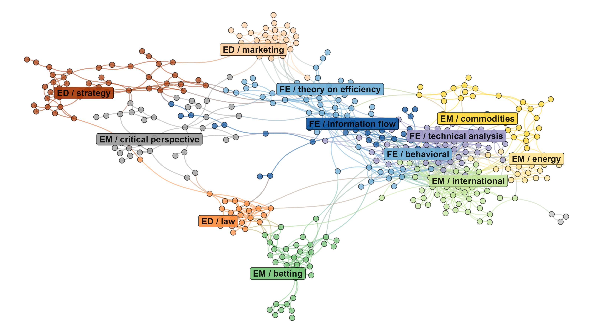
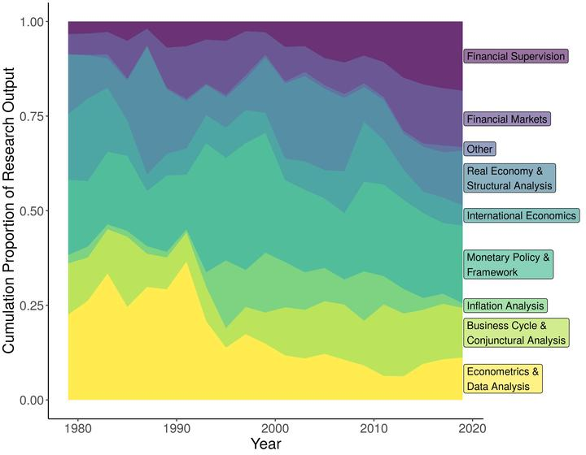
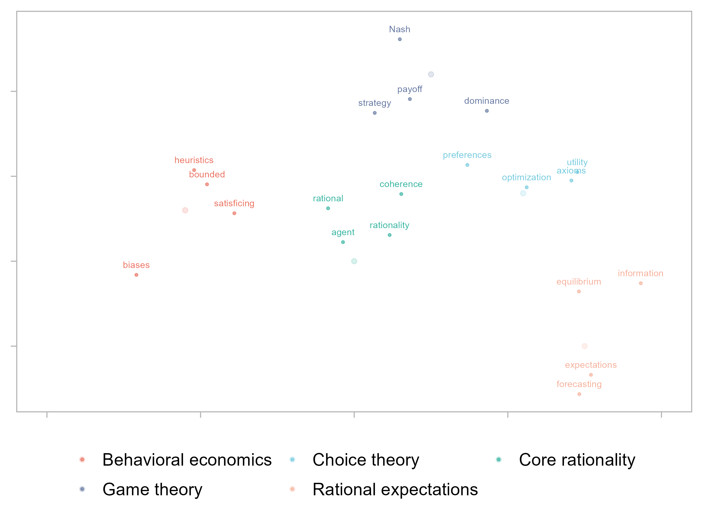
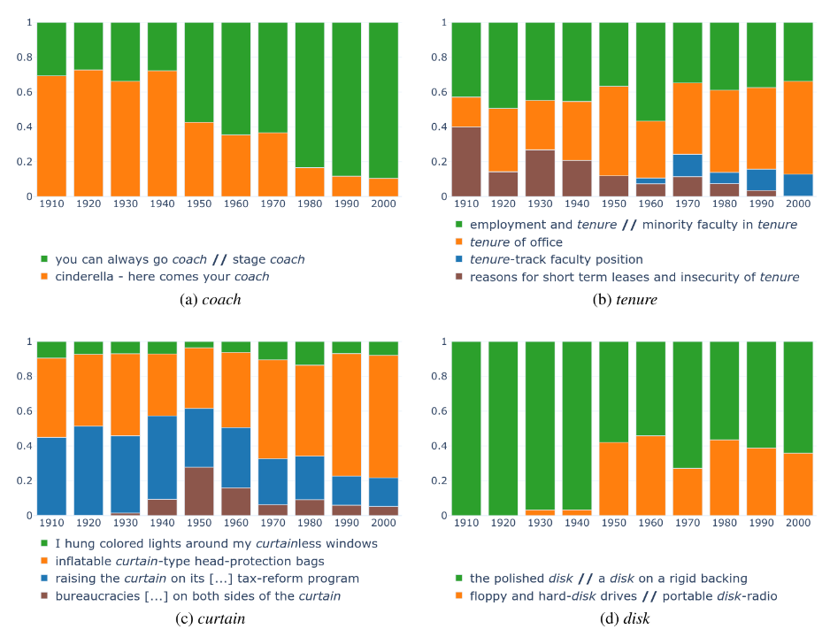
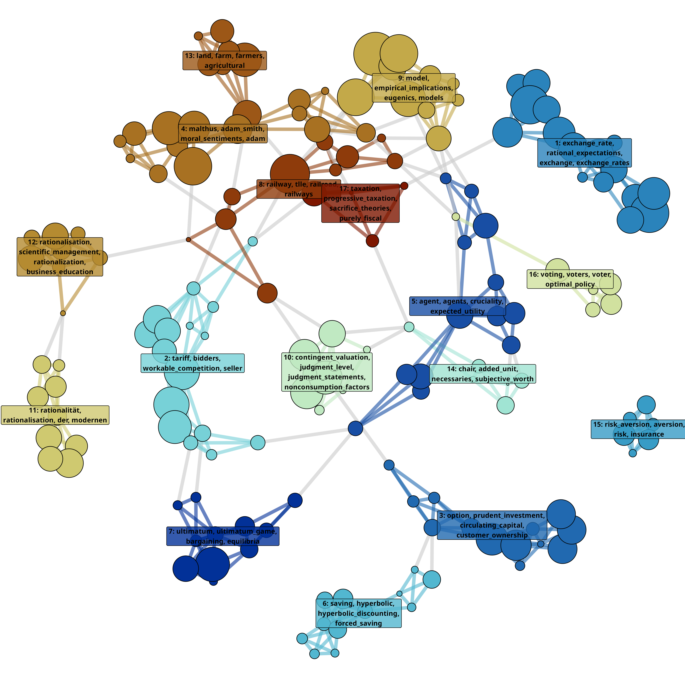
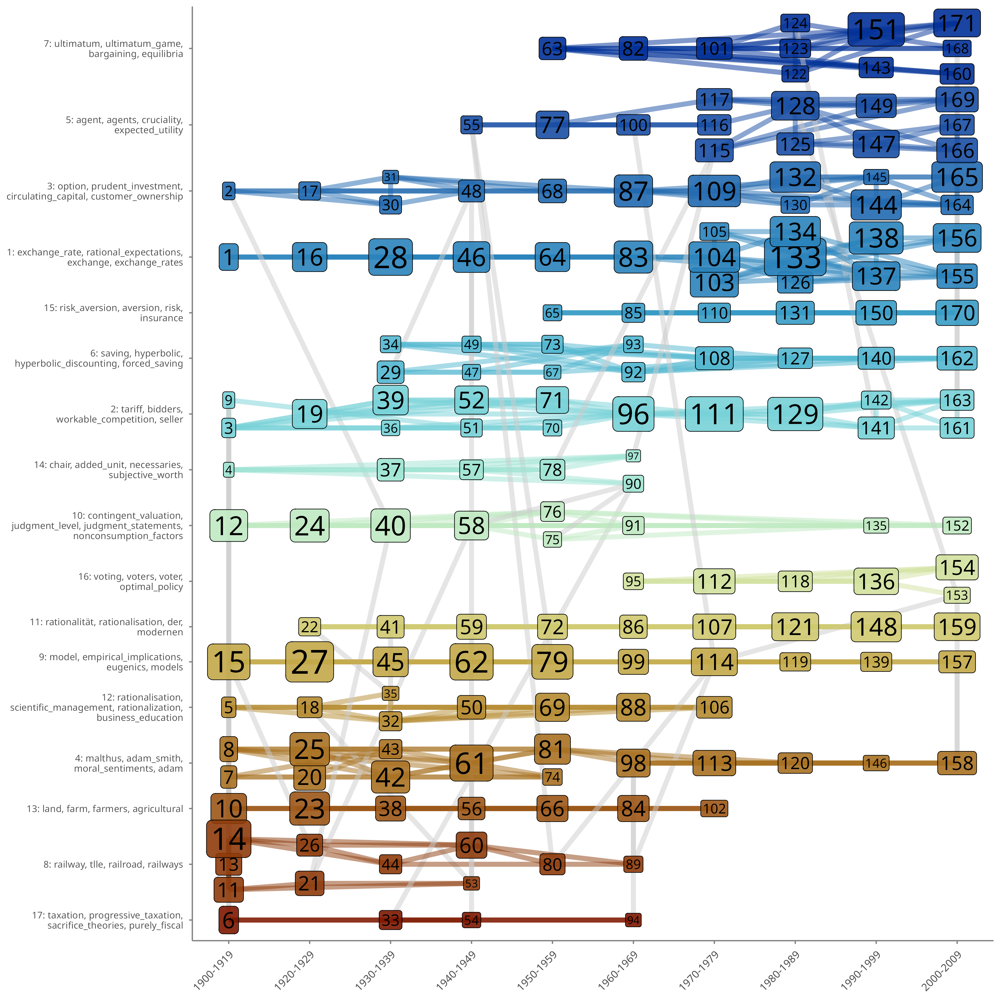

## 

:::{.highlight-last .very-small-text}

### [One Sentence at a Time: A Computational History of Rationality in Economics](https://osf.io/preprints/socarxiv/38na2_v1) - Delcey, Goutsmedt and Truc

:::{.fragment .nonincremental}
- Utiliser des méthodes textuelles pour saisir l'évolution des usages et des significations de la rationalité :
    - Une préoccupation de longue date pour les historiens de l'économie ;
    - Un concept complexe et en évolution.
:::

:::{.fragment .nonincremental}
- Construire une méthode visant à :
    - explorer des corpus très vastes (des millions de phrases) ;
    - prendre en compte le contexte historique ;
    - permettre l'exploration interprétative des résultats.

:::

:::{.callout .fragment}
Reconstruire l'histoire de ce projet de recherche à travers la manière de le visualiser
:::
:::

:::{.notes}
- Présentation 
  - Histoire de la discipline économique.
  - Emergence des méthodes quantitatives en histoire de la pensée économique.
- Une histoire de la manière dont les économistes utilisent le concept de rationalité. Qu'est-ce que la rationalité pour eux, qu'est-ce que cela implique pour les agents? Pour quels problèmes le concept est-il utilisé? Faire cela dans une perspective d'histoire longue.
- Article de recherche récent dans le cadre d'un numéro spécial
- Utiliser des méthodes textuelles: text mining, NLP, text as data. La publication académique comme source de la donnée. Utiliser des méthodes computationelles appropriées pour analyser ce type de source.
  - Pourquoi ce concept: longue histoire dans la discipline, concept complexe et en évolution.
- Que doit être capable de faire la/les méthodes choisies:
  - traiter de très grand corpus. Plus de 110 ans de publications (60 millions de phrases et 290k articles d'économie).
  - Contexte historique: important aussi dans la visualisation. Etre capable de situer les résultats dans le temps, et donc d'avoir des méthodes relativement adaptées à la dimension historique du projet. Ne pas calquer les définitions actuelles de la rationalité. Observer les usages de la rationalité tels qu'ils se font à un moment donné. 
  - Particularité de la recherche en HPE mais aussi, de l'histoire intellectuelle plus généralement. Méfiance envers le quantitatif, et rôle important de l'interprétation du texte, de sa contextualisation, etc... Important d'avoir une méthode qui permette des allers-retours entre les résultats quantitatifs et l'interprétation qualitative, l'analyse textuelle traditionnelle.
- Voici les grandes lignes du projet d'article. Proposer une présentation originale de ce travail à travers la visualisation. Car véritable enjeux de visualisations. Sans trop forcer le trait, nombreuse étape et choix méthodologiques guidés à un moment ou à un autre par la visualisation. Repenser la méthode est passé parfois pa la manière de repenser la visualisation des résultats. Forte imbrication entre les deux.
  - Beaucoup de visualisations dans mes slides pour illustrer cela. Certains visualisations sont des "brouillons". 
- N'hésitez pas à poser des qeustions à tout moment, notamment sur la méthode et les visualisations.
:::

## Quelles méthodes pour l'histoire de la pensée économique?

:::{.fragment}
::: {layout-ncol=2}

{width=100%}

{width=100%}


:::
:::

:::{.notes}
- Si les méthodes quantitatives s'implantent récemment en HPE, quelles sont les méthodes utilisées. 
  - Un type de méthode particulier, assez loin de ce que vous allez trouver en économie (pas d'économétrie, pas de modèles formels, etc...). Moins loin de la socio quantitative (ACM, ACP), mais assez différent quand il s'agit de méthode textuelle.
  - Fil commun : méthodes non-supervisées. Découverte de structure dans les données; identification de catégories émergentes.
- Couplage bibliométrique
- Topic modeling
:::

## 

:::{.center-content}
](../images/alluvial_dhm.png){width=67%}
:::

:::{.notes}
- Couplage bibliométrique au coeur d'un projet plus large sur l'histoire de la macroéconomie. 
  - Enjeu : cartographier les sous-champs de la macroéconomie, leurs évolutions, leurs interactions.
  - Problème du couplage: ne marche pas sur longue période (trop de changements dans les pratiques de citations, etc...).
  - Trouver une manière d'identifier des communautés intertemporelles.
  - Comment visualiser cela. A travers un diagramme de flux, un alluvial, synthétique.
:::

## Méthodes non-supervisées & interprétation

:::{.highlight-last .very-small-text}
:::{.fragment .nonincremental}
- Utilisation d'algorithme pour identifier des structures dans les données
  - Produire des catégorisations qui ne sont pas données à priori par le ou la chercheur·se
:::

:::{.fragment .nonincremental}
- Non-supervisé ne veut pas dire sans moyen de faire varier la composition, la taille et le nombre de catégories
  - Implique de tester différents jeux de paramètres
:::

:::{.fragment .nonincremental}
- Mais que signifie ces catégories ? Pourquoi certains documents sont groupés ensemble ?
  - Nécessite un travail d'interprétation qualitative
  - Nécessite un travail de visualisation adapté, pour faire apparaître ce qui caractérise ces catégories, ce qui les lie et les différencie
:::
:::

:::{.notes}
- Quel intérêt des méthodes non-supervisées: éviter l'anachronisme, laisser émerger des choses inattendues, permettre un travail de zoom et de dézoom. (Augmenter le nombre de catégories pour une méthode non-supervisée comporte beaucoup moins de risques que faire de même avec une méthode supervisée)
:::

## Mesurer le "sens" de la rationalité: embeddings et *Large Language Models*

:::: {.columns}
::: {.column width="65%"}

{width=90%}
:::

::: {.column width="35%" .small-text .highlight-last}

::: {.callout-tip .fragment .nonincremental appearance="simple"}
- La distance entre les vecteurs reflète la similarité sémantique.
- Métrique de distance : similarité cosinus.
::: 

::: {.callout-note .fragment .nonincremental  appearance="simple"}
- Premiers modèles : *embeddings* fixes (e.g., word2vec, GloVe).
- LLMs : *embeddings* contextuels (e.g., BERT, GPT, etc.).
::: 

::: 
::::

:::{.notes}
- Modèle d'*embeddings*: modèle entraînés pour représenter des mots ou des phrases comme des vecteurs dans un espace multidimensionnel.
  - entraînement sur de grands corpus textuels pour deviner le contexte des mots, ou les mots manquants, ou des phrases qui se suivent.
- La position des mots dans cet espace reflète leur signification et leur usage. Plus de proximité = plus de similarité sémantique.
- Mesure par la similarité cosinus: valeur entre -1 et 1 qui indique à quel point deux vecteurs pointent dans la même direction.
- Embeddings fixes: chaque mot a une représentation unique, indépendamment du contexte.
- Embeddings contextuels: la représentation d'un mot ou d'une phrase dépend du contexte dans lequel il apparaît, capturant ainsi des nuances sémantiques plus fines. Permet de prendre en compte la polysémie.
:::

## Sentence embeddings 

::: {.callout-note appearance="simple"}
On utilise *sentence-BERT*, un modèle LLM qui représente des **phrases** comme des vecteurs et est optimisé pour les tâches de similarité sémantique.
::: 

. . . 


```{r}
#| echo: false
#| message: false
#| warning: false
#| label: tbl-top_sentences
#| tbl-cap: 'Phrases proches de "Economic agents are supposed to be rational."'

# load data OUTPUT_FILE = top_5_sentences_to_fake_sentence.feather
source(here::here("scripts", "paths_and_packages.R"))
data <- arrow::read_feather(here::here(
  data_path,
  "top_5_sentences_to_fake_sentence.feather"
))

# ;2 "Basically, for Professor Hicks, as for Jevons and Marshall, economic decisions are made by an abstract calculating machine";3 "I find myself continuing to believe ... that, whatever the origin of the want, when it rises to consciousness, it is subject to a process which we call rational, when the human agent decides
sentence_clean <- "Basically, for Professor Hicks, as for Jevons and Marshall, economic decisions are made by an abstract calculating machine."

data |>
  filter(rank < 4, year %in% c(1950, 1975, 2000)) |>
  mutate(
    sentence = ifelse(str_detect(sentence, "^;"), sentence_clean, sentence)
  ) |>
  # kable the table
  select(year, sentence, similarity) |>
  mutate(similarity = round(similarity, 3)) |>
  gt::gt() |>
  gt::tab_options(table.font.size = 15)

```

## Mesurer polysémie & évolution sémantique

:::{.fragment}
{width=60%}
:::

:::{.notes}
- Embeddings utile pour mesurer la polysémie, mais comment faire exactement? Une papier qui nous avait intéressé, notamment pour ses visualisations temporelles.
- Apparition et propension des sens au fil du temps.
- Comment ça marche: ici on a l'impression que ce sont vraiment des sens qui sont identifiés, mais ce qu'on voit c'est des exemples retravaillés des sens. Le résultat sous-jacent, ce sont des clusters de phrases comportant le terme. Chaque cluster est interprété comme un sens différent. Voilà l'idée.
- Dans leur papier, ils appliquent cela à un très large vocabulaire. Pour nous, uniquement deux mots. possibilité de zoomer beaucoup plus d'être plus fin dans l'analyse. Volonté de prendre vraiment en compte la dimension historique (corpus beaucoup plus gros dans les années récentes qui risque d'écraser les périodes plus anciennes.)
:::

## Stratégie empirique

::: {.highlight-last .tiny-text}
1. Calculer des "vecteurs représentatifs" pour le concept de rationalité.
    1. Sélectionner toutes les phrases contenant les mots "rational" ou "rationality". 
    1. Calculer l'*embeddings* de ces phrases. 
    1. Calculer une moyenne mobile de ces vecteurs = un "vecteur représentatif" par an.

2. Extraire les phrases similaires dans le corpus à partir de ce vecteur.
    1. Pour chaque année, calculer la similarité cosinus entre le "vecteur représentatif" et les 61M d'*embeddings* de phrases du corpus. 
    2. Sélectionner le top 1% des phrases les plus similaires pour chaque année

3. Grouper ces phrases en clusters.
    1. Regrouper les phrases par décennie.
    1. Calculer les centroïdes des clusters pour fusionner les clusters similaires en méta-clusters.
::: 
 
## L'alluvial des clusters intertemporels

{width=85% fig-align="center"}

:::{.notes}
- On peut voir l'influence de la visualisation par alluvial
- Comment est-ce qu'on groupé les clusters ici? Comme pour le couplage bibliométrique: on regarde les clusters dans deux fenêtres consécutives; si ils sont assez proches, on les relie. 
- Points forts: représentation synthétique. Montre bien la proportion des clusters dans chaque période, ainsi que l'apparition de nouveau méta-cluster
- Points faibles: beaucoup d'informations avec la nécessité de zoomer. Trop de couleurs. Pas de détails sur les cluster à chaque période car aggégation. Que représente les flux? Rien !
- Revenons sur la méthode: Mais peut-être arbitraire (le second cluster le plus proche peut-être aussi très proche). Ou bien pas de cluster si proche en t + 1, mais possible en t + 2
:::

## 

### Le retour aux réseaux

::: {layout-ncol=2}

:::{.fragment}
{width=55% fig-align="center"}
:::
:::{.fragment}
{width=53% fig-align="center"}
:::
:::

:::{.notes}
- Comparaison insatisfaisante des clusters deux à deux, bien représenté par l'inutilité des "flux", nous a fait repasser par le réseau.
- Oublier les couleurs. Chaque point est un cluster. Les liens sont la similarité. Méthode de pruning pour ne garder que les liens les plus significatifs statistiquement. 
- Vision plus globale plutôt que deux à deux. Voir comment les noeuds se regroupent, lesquels sont proches. Passer par le réseau pour créer les méta-clusters. 
- Permet d'avoir une perspective centre/périphérie, mais aussi quels clusters sont les plus connectés entre eux, lesquels sont des groupements moins uniformes.
- Quel problème majeur ici? perte de la dimension historique. Comment remettre de l'histoire Sans perdre trop d'information.
- Trouver comment positionner les clusters dans la dimension verticale: clustering hiérarchique pour mettre ensemble les meta-clusters les plus proches.
:::

## Mais à quoi correspondent ces clusters ?

::: {.highlight-last .smaller-text}
- Limite dans la quantité d'information à afficher dans une visualisation globale.
- Nécessité de pouvoir zoomer dans les clusters pour en comprendre le contenu.
  - Développement d'un ensemble d'indicateurs complémentaires
    - Mots les plus fréquents
    - Phrases représentatives
    - Articles représentatifs
    - Références citées
- Comment organiser et afficher ces informations ?
  - Production de long rapports HTML
  - Développement d'une application interactive pour l'exploration des résultats
:::


## Utiliser une application interactive pour explorer les résultats

[https://019adac8-81d4-aa0e-808c-08861c261fd2.share.connect.posit.cloud/](https://019adac8-81d4-aa0e-808c-08861c261fd2.share.connect.posit.cloud/)

:::{.notes}
- L'application sert des fonctions multiples:
  - avant toute chose, elle est un outil de travail et d'exploration pour le chercheur lui même
  - c'est un outil de transparence pour que les évaluateurs et lecteurs puissent vérifier le narratif avancé par les auteur.ices, à condition que ces derniers soit transparent sur leur usage de l'app
  - c'est un outil qui permet de prolonger la recherche et de l'étendre, en permettant à d'autres d'utiliser l'application.
:::

## Bibliographie