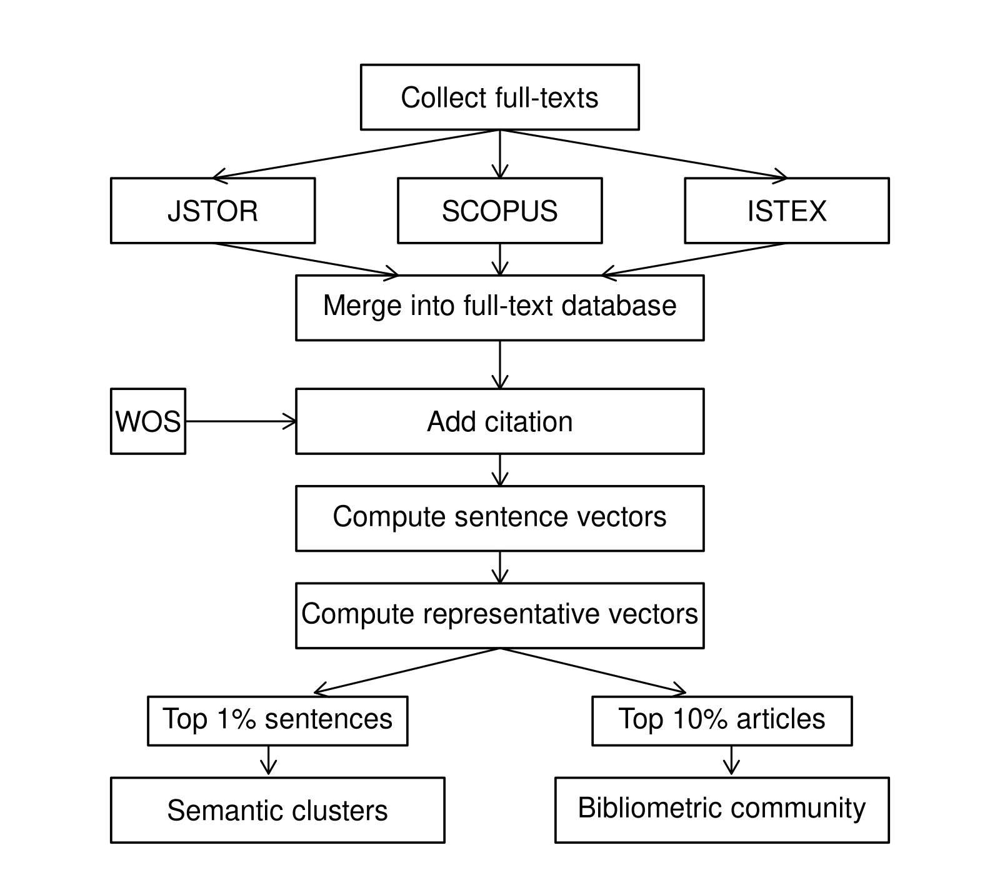
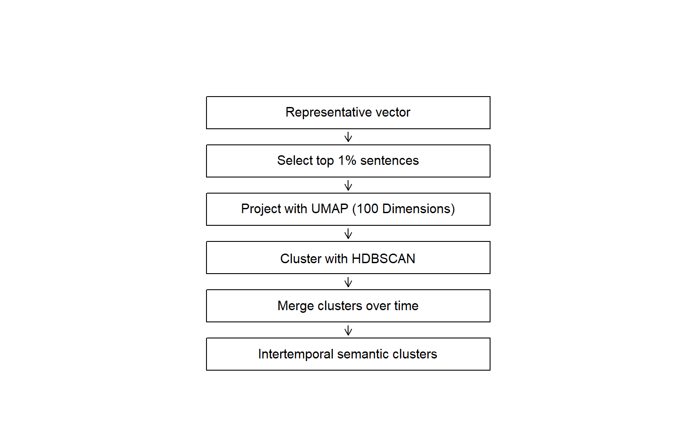
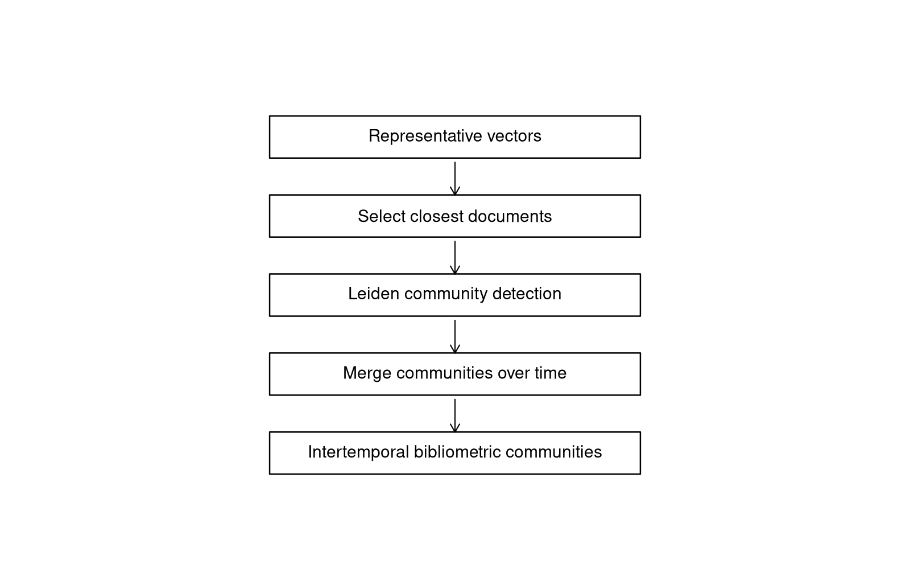

\name{Thomas Delcey\textsuperscript{a}\thanks{CONTACT Thomas Delcey. Email: thomas.delcey@ube.fr},
  Aurélien Goutsmedt\textsuperscript{b}\thanks{Email: aurelien.goutsmedt@uclouvain.be},
  and Alexandre Truc\textsuperscript{c}\thanks{Email: alexandre.truc@cnrs.fr}}
\affil{\textsuperscript{a}Université de Bourgogne
       \textsuperscript{b}UC Louvain, ISPOLE; ICHEC Brussels
       \textsuperscript{c}Université Côte d'Azur}


\begin{abstract}
This article offers a concrete, method-driven demonstration of how unsupervised quantitative methods can enrich the history of economic thought. Focusing on the long and shifting history of rationality in economics, we assemble and analyze the most extensive English-language corpus ever used for a historical study of economics, with nearly 290,000 full-text journal articles published between 1900 and 2009, paired with structured citation data. Combining large language model–based semantic analysis with bibliometric and network methods, we trace how economists have discussed, reformulated, and contested rationality over more than a century. Our approach identifies sentences and articles most closely associated with rationality, groups them into semantic clusters and bibliometric communities within short time windows, and then aggregates these groupings over time. This multi-scale design makes it possible to both “zoom out” to capture broad intellectual transformations and “zoom in” to examine specific debates, research programs, and moments of reception. Beyond substantive findings—illustrated through the contrasting trajectories of bounded rationality and behavioral economics—the article advances a broader methodological argument. We show that unsupervised quantitative methods, when combined with close reading and historiographical expertise, function not only as tools of confirmation but also as genuine discovery devices, revealing patterns, continuities, and tensions that remain difficult to grasp through traditional approaches alone. To foster transparency and reuse, we also release an open-source interactive application that allows readers to explore the clusters, indicators, and interpretive pathways underlying our analysis.
\end{abstract}

\begin{keywords}
rationality; economics history; bibliometrics; behavioral economics; natural language processing; large language models
\end{keywords}

\begin{jelcode}
B00; B20
\end{jelcode}


```{r}
#| echo: false
#| message: false
#| warning: false
#| label: setup

source(here::here(".", "scripts", "paths_and_packages.R"))

# load kable 

pacman::p_load(knitr, 
               kableExtra, 
               kableExtra)

```

```{r}
#| label: fetch-gdoc
#| eval: FALSE
#| echo: false
#| message: false
#| warning: false
library(googledrive)
library(rmarkdown)

drive_auth()
# Réutiliser le cache OAuth déjà créé

if (!googledrive::drive_has_token()) {
  stop(
    "Aucun jeton Google Drive trouvé. Exécute d'abord drive_auth() une fois dans la console R."
  )
}

# ID du Google Doc (⚠️ sans ?tab=... ni #heading=...)
gdoc_id <- as_id("15FmpiiUkR_PV2nqE_TDLHay4b530zdB82Gsox1vvdLU")

# Dossier cible dans le projet
docx <- here::here("paper", "gdoc.docx")
md <- here::here("paper", "gdoc.md")

# 1) Télécharger en .docx
drive_download(
  gdoc_id,
  path = docx,
  type = "application/vnd.openxmlformats-officedocument.wordprocessingml.document",
  overwrite = TRUE
)

# 2) Convertir en .md
rmarkdown::pandoc_convert(
  input = docx,
  to = "markdown",
  output = md,
  citeproc = FALSE,
)

# 3) nettoyage des antislashs indésirables (\[ \] \@)
txt <- readLines(md, warn = FALSE)
txt <- str_replace_all(txt, "\\\\([\\[\\]@>])", "\\1")
writeLines(txt, md)
```



# References

::: {#refs}
:::

\newpage

# Figures  

::: {#fig-distribution layout-nrow="2"}

{#fig-fulltextdistribution_a width="86%"}

{#fig-fulltextdistribution_b width="86%"}

Distribution of documents and languages in the full-text database over time (1900-2009).
::: 

::: {#fig-relative-frequency}


Relative frequency of terms "rational" and "rationality" in the jstor database (1900-2009). Points are the empirical data. Lines are the loess smoothed trends.
::: 

{#fig-co-occurence}

{#fig-rationality-paper-citations}

```{r}
#| echo: false
#| message: false
#| warning: false

sentences <- read_feather(here::here(
  data_path,
  "illustrative_table_closest_sentences_to_rv.feather"
))

documents <- read_feather(here::here(
  data_path,
  "illustrative_table_closest_documents_to_rv.feather"
))

# --- prepare tables ---
sentences_tbl <- sentences %>%
  filter(year == 1910) %>%
  mutate(similarity_rv = round(similarity_rv, 3)) %>%
  select(sentence, similarity_rv)

documents_tbl <- documents %>%
  filter(year == 1910) %>%
  mutate(similarity_rv = round(cosine_doc_with_rv, 3)) %>%
  select(title, authors, journal, similarity_rv)

```

```{r}
#| label: tbl-illustrative_sentences
#| tbl-cap: "Sentences from the corpus closest to the representative vector in 1910."
#| echo: false
#| message: false
#| warning: false

# === Subtable 1: Sentences
sentences_tbl %>%
  kbl(
    format = "latex",
    booktabs = TRUE,
    col.names = c("Sentence", "Cosine similarity"),
    align = c("l", "c"),
    escape = FALSE
  ) %>%
  kable_styling(font_size = 9, latex_options = c("striped")) %>%
  column_spec(1, width = "11cm") %>%
  column_spec(2, width = "2cm") 

```

```{r}
#| label: tbl-illustrative_documents
#| tbl-cap: "Documents from the corpus closest to the representative vector in 1910."
#| echo: false
#| message: false
#| warning: false

documents_tbl %>%
  kbl(
    format = "latex",
    booktabs = TRUE,
    col.names = c("Title", "Authors", "Journal", "Cosine similarity"),
    align = c("l", "l", "l", "c"),
    escape = FALSE
  ) %>%
  kable_styling(font_size = 9, latex_options = c("striped")) %>%
  column_spec(1, width = "5cm") %>%
  column_spec(2, width = "2.5cm") %>%
  column_spec(3, width = "3cm") %>%
  column_spec(4, width = "1.5cm") %>%
  # add footnote
  footnote(general = "Documents vectors are computed as the average of their sentences vectors.")

```

\newpage

# Appendix 

We provide here an overview of the data and methods used to build our databases and our methods to build intertemporal semantic clusters and bibliometric communities. @fig-method-schema summarizes the general workflow. We describe the construction of the full-text database, the computation of sentence embeddings and representative vectors of rationality, and the clustering methods used to build our semantic clusters and bibliometric communities.

```{r}
#| label: fig-method-schema
#| echo: false
#| message: false
#| warning: false
#| eval: false
#| fig-pos: "H"

out_path <- here::here("paper", "images", "method_schema.png")
png(out_path, width = 1600, height = 1000, res = 300)
op <- par(mar = c(0, 0, 0, 0))
plot.new()
plot.window(xlim = c(0, 1), ylim = c(0, 1))

draw_box <- function(x, y, w, h, label) {
  rect(x, y, x + w, y + h, lwd = 1.2)
  text(x + w / 2, y + h / 2, label, cex = 0.9)
}

draw_arrow <- function(x0, y0, x1, y1) {
  arrows(x0, y0, x1, y1, length = 0.08, lwd = 1.0)
}

# Top: collection
draw_box(0.35, 0.88, 0.30, 0.08, "Collect full-texts")
draw_box(0.08, 0.74, 0.22, 0.08, "JSTOR")
draw_box(0.39, 0.74, 0.22, 0.08, "Elsevier")
draw_box(0.70, 0.74, 0.22, 0.08, "ISTEX")

# Middle pipeline
draw_box(0.28, 0.62, 0.44, 0.08, "Merge into full-text database")

# Web of Science square to the left of the "Add citation" step
draw_box(0.08, 0.48, 0.08, 0.08, "WOS")

# Add citation
draw_box(0.28, 0.48, 0.44, 0.08, "Add citation")

draw_box(0.28, 0.36, 0.44, 0.08, "Compute sentence vectors")
draw_box(0.28, 0.24, 0.44, 0.08, "Compute representative vectors")

# Intermediate outputs from representative vectors
draw_box(0.12, 0.12, 0.28, 0.06, "Top 1% sentences")
draw_box(0.6, 0.12, 0.28, 0.06, "Top 10% articles")

# Bottom: clustering outputs
draw_box(0.08, 0.00, 0.36, 0.08, "Semantic clusters")
draw_box(0.56, 0.00, 0.36, 0.08, "Bibliometric community")

# Arrows from "Collect full-texts" to sources
draw_arrow(0.50, 0.88, 0.19, 0.82)
draw_arrow(0.50, 0.88, 0.50, 0.82)
draw_arrow(0.50, 0.88, 0.81, 0.82)

# Arrows from sources to merged database
draw_arrow(0.19, 0.74, 0.39, 0.70)
draw_arrow(0.50, 0.74, 0.50, 0.70)
draw_arrow(0.81, 0.74, 0.61, 0.70)

# Pipeline arrows
draw_arrow(0.50, 0.62, 0.50, 0.56)  # Merge -> Add citation
draw_arrow(0.50, 0.48, 0.50, 0.44)  # Add citation -> Sentence vectors
draw_arrow(0.50, 0.36, 0.50, 0.32)  # Sentence vectors -> Representative vector

# Arrow from WoS square to "Add citation"
draw_arrow(0.16, 0.52, 0.28, 0.52)

# Arrows from representative vector to the two intermediate boxes
draw_arrow(0.50, 0.24, 0.3, 0.185)  # to Top 1% sentences (left)
draw_arrow(0.50, 0.24, 0.7, 0.185)  # to Top 10% articles (right)

# Arrows from intermediate boxes to final outputs
draw_arrow(0.25, 0.12, 0.25, 0.085)  # Top 1% sentences -> Semantic clusters
draw_arrow(0.75, 0.12, 0.75, 0.085)  # Top 10% articles -> Bibliometric community

par(op)
dev.off()
```

{#fig-method-schema}

## Collecting data 

```{r}
#| label: load-metadata
#| echo: false
#| message: false
#| warning: false

path <- file.path(data_path, "metadata_maintext.feather")
metadata <- read_feather(path)

metadata_1950_2009 <- metadata %>%
  filter(year >= 1950)
```

```{r}
#| label: create-list-journals
#| echo: false
#| message: false
#| warning: false
#| eval: false

list_journal <- metadata %>%
  distinct(journal) %>%
  arrange(journal)

# save list of journals in xlsx
xlsx::write.xlsx(
  list_journal,
  file = here::here("paper", "list_of_journals.xlsx"),
  sheetName = "Journals",
  row.names = FALSE
)

```

The full-text database is built from three main sources: JSTOR, Elsevier and ISTEX. The main source is JSTOR, which provides the largest coverage of historical economics journals. However, some important economics journals published by Elsevier are missing from JSTOR. We therefore complement JSTOR with documents from SCOPUS journals using two supplementary sources: Elsevier and ISTEX. We used Elsevier API to access Elsevier's economics journals full-texts after 1997; we used ISTEX to retrieve older Elsevier documents.

To identify economics documents, we first created a list of economic journals to query these databases. We built a list of journals classified as economics in our sources and in Econlit and then review them manually to ensure they are economics and academic journals. We also filtered out very recent journals (less than 20 years old). The rationale is to focus on journals with a sufficiently long publication history to allow meaningful intertemporal comparisons. This criterion primarily aims to reduce short time-series effects. We end up with `r n_distinct(metadata$journal)` unique journals. The list of journals is available in the supplementary material. Once we have the list of journals, we queried each source to retrieve all available documents published by these journals between 1900 and 2009. We keep only documents classified as research articles (i.e., we remove editorials, book reviews, etc.) and written in English. 

This results in a total of `r nrow(metadata)` documents that represent our curated metadata. @tbl-database-sources summarizes the sources of our full-text database. While JSTOR and ISTEX provide raw OCR full-texts, Elsevier provides structured full-texts divided into paragraphs. Elsevier provides full texts structured in an XML format, which we parse to extract paragraphs. It ensures a higher quality of text segmentation compared to raw OCR that do not distinguish main text from other elements (headings, footnotes, *etc*.). Each source provides documents at different levels of granularity: Elsevier provides paragraph-level data, JSTOR page-level data, while ISTEX provides no such segmentation. 

We enrich our full-text database with citation data from Web of Science (WOS). The main challenge is to match documents from our full-text database with WOS records. To match the fulltexts to WOS citation data, we apply a series of deterministic matching strategies, starting with strict combinations of metadata (title, journal, volume, issue, year, and page ranges, etc.). @tbl-database-sources indicates the proportion of documents successfully matched to WOS records for each source. After 1950---citation data are rare before this date---we achieve an overall match rate of `r round(mean(!is.na(metadata_1950_2009$id_wos_matched)) * 100, 1)`\%. 

```{r}
#| echo: false
#| label: tbl-database-sources
#| tbl-cap: "Sources of the full-text database."

# we did not save the source in the metadata, so we reconstruct it here using ids
ids_istex <- readRDS(here::here(
  elsevier_data_path,
  "istex_ids_from_doi.rds"
)) %>%
  distinct(dc_identifier) %>%
  pull(dc_identifier)

metadata_source <- metadata %>%
  mutate(
    source = case_when(
      id %in% ids_istex ~ "ISTEX",
      str_detect(id, "jstor") ~ "JSTOR",
      str_detect(id, "Elsevier") ~ "Elsevier"
    )
  ) %>%
  group_by(source) %>%
  mutate(
    "Format" = case_when(
      source == "Elsevier" ~ "structured",
      TRUE ~ "raw OCR"
    ),
    "Unit of text" = case_when(
      source == "JSTOR" ~ "page",
      source == "Elsevier" ~ "paragraph",
      TRUE ~ "full text"
    )
  )

table_source <- metadata_source %>%
  group_by(source) %>%
  summarise(
    n_documents = n(),
    n_journals = n_distinct(journal),
    `Unit of text` = first(`Unit of text`),
    Format = first(Format),
    pct_wos_matched = mean(!is.na(id_wos_matched)) * 100,
    pct_wos_matched = round(pct_wos_matched, 1)
  )

table_source %>%
  kbl(
    format = "latex",
    booktabs = TRUE,
    col.names = c(
      "Source",
      "Documents",
      "Journals",
      "Unit of text",
      "Format",
      "WOS matched"
    ),
    align = c("l", "c", "c", "c", "c", "c"),
    escape = FALSE
  ) %>%
  kable_styling(font_size = 9, latex_options = c("striped")) 

```

## Sentence embeddings 

We compute sentence embeddings with Sentence-BERT, using the pretrained model [\texttt{sentence-transformers/all-mpnet-base-v2}](https://huggingface.co/sentence-transformers/all-mpnet-base-v2). This model yields a single 768-dimensional dense vector per sentence. It has been shown to perform well on various semantic textual similarity tasks and is widely used in natural language processing applications. We use the `sentence-transformers` Python library to compute the embeddings. 

In order to split textual units into sentences, we first use the `sent_tokenize` from the NLTK Python library. This function applied basic rules to split text into sentences based on punctuation and capitalization. While there are more advanced models for sentence segmentation (e.g., `spacy`), they are computationally intensive and not easily scalable to a corpus of millions of sentences. This rule-based segmentation may amplify noise in OCR-based texts such as those from JSTOR and ISTEX, which often contain punctuation and capitalization errors. One important issue with OCR texts is page break. When a sentence is split across two pages, the tokenizer may fail to recognize it as a single sentence. For instance, page breaks or footnotes may lead to the erroneous merging of unrelated textual fragments. Such errors cannot be fully corrected at scale; however, given the size of the corpus, their impact is expected to average out in aggregate analysis. We only remove sentences for which the segmentation is almost certainly incorrect and provide no information, i.e., sentences that contain less than 20 characters, less than three words, or contain more than 50\% digits. 

A more serious issue is the presence of paratextual sentences (e.g., affiliations, acknowledgements, headers, references) in JSTOR and ISTEX OCR full-texts. These sentences introduce important noise. For instance, because references often contain similar wording (e.g., "Journal of...", "Vol.", "pp.", etc.), they tend to cluster together in the embedding space. We use this property at our advantage. Because paratextual sentences tend to be semantically similar, they form dense regions in the embedding space, which we exploit to identify and remove them. We first define four categories of noisy sentences: affiliations, acknowledgements, headers, references. For each category, we use regular expressions to identify a set of sentences that likely belong to this category. We compute (i) the centroid vector of these sentences and (ii) the cosine similarity between those centroids and each sentence embedding. Sentences that are above a certain similarity threshold are flagged as noisy and removed from the document. We determine the similarity threshold using Youden’s J statistic, computed by contrasting regex-identified noisy sentences with a random sample of other sentences. Because the filtering operates at the sentence level and targets dense regions associated with paratextual material, occasional false positives are unlikely to affect aggregate semantic trends.

## Representative vectors 

For each year, we keep sentences whose text matches "rational" or "rationality", (regex: `\brational(?:ity)?\b`) excluding any sentences flagged as noise and any records outside the curated metadata. We compute the mean of these sentence embeddings to obtain a year-specific representative vector of rationality. We compute an unweighted centered moving average over an 11-year window (year $t\pm5$) to produce the final representative vector series used in subsequent similarity calculations. We rely on an unweighted procedure—averaging each year’s vectors before averaging across the 11-year window—in order to smooth short-term fluctuations while avoiding an overemphasis on more recent conceptions of rationality.

## Semantic clusters 

This section details the text clustering methods used to identify semantic clusters related to rationality over time. @fig-text-clustering-schema shows the workflow. We describe each step in detail.

```{r}
#| label: fig-text-clustering-schema
#| echo: false
#| message: false
#| warning: false
#| eval: false
#| fig-cap: "Semantic clustering workflow."


out_path <- here::here("paper", "images", "text_clustering_schema.png")
png(out_path, width = 1600, height = 1000, res = 200)
op <- par(mar = c(0, 0, 0, 0))
plot.new()
plot.window(xlim = c(0, 1), ylim = c(0, 1))

draw_box <- function(x, y, w, h, label) {
  rect(x, y, x + w, y + h, lwd = 1.2)
  text(x + w / 2, y + h / 2, label, cex = 0.9)
}

draw_arrow <- function(x0, y0, x1, y1) {
  arrows(x0, y0, x1, y1, length = 0.08, lwd = 1.0)
}

draw_box(0.28, 0.72, 0.44, 0.08, "Representative vector")
draw_box(0.28, 0.60, 0.44, 0.08, "Select top 1% sentences")
draw_box(0.28, 0.48, 0.44, 0.08, "Project with UMAP (100 Dimensions)")
draw_box(0.28, 0.36, 0.44, 0.08, "Cluster with HDBSCAN")
draw_box(0.28, 0.24, 0.44, 0.08, "Merge clusters over time")
draw_box(0.28, 0.12, 0.44, 0.08, "Intertemporal semantic clusters")

draw_arrow(0.50, 0.712, 0.50, 0.688)
draw_arrow(0.50, 0.592, 0.50, 0.568)
draw_arrow(0.50, 0.472, 0.50, 0.448)
draw_arrow(0.50, 0.352, 0.50, 0.328)
draw_arrow(0.50, 0.232, 0.50, 0.208)

par(op)
dev.off()
```

{#fig-text-clustering-schema}

### Selecting sentences related to rationality

To identify the sentences most closely related to rationality, we compare every sentence embedding to the year-specific representative vector (RV). For each year, we compute cosine similarity between each sentence vector and the RV of the same year. We retain the top 1% most similar sentences. This threshold balances two competing objectives. On the one hand, we want to capture a sufficient number of sentences to represent the diversity of ways rationality is discussed in each year. On the other hand, we want to focus on sentences that are strongly related to rationality to avoid diluting the analysis with less relevant content. 

### Clustering with HDBSCAN

We cluster the top 1\% sentences within temporal windows using HDBSCAN. To make clustering tractable while preserving semantic structure, we first project the 768-dimensional sentence embeddings to a 100-dimensional UMAP space (metric = cosine, n_neighbors = 15, min_dist = 0.0). Intuitively, the rationale for using UMAP is that high-dimensional spaces are often sparse, making distance-based clustering less effective. UMAP finds a lower-dimensional representation of the data that preserves information of the original high-dimensional space. This is a standard practice in text clustering workflows [e.g., @benzMapping2025].

The UMAP fit uses a sampling strategy that keeps all pre-1980 sentences and caps the post-1980 years at 30,000 sentences each, then we transform the full dataset with the fitted model. This approach aims to avoid over-representing recent years in the UMAP fit while retaining their semantic structure. We define time windows as 1900--1919 (merged) followed by standard decades from 1920--1929 through 2000--2009. Within each window, we run HDBSCAN on the UMAP coordinates. HDBSCAN's hyperparameters, in particular `min_cluster_size` and `min_samples`, influence the granularity of the clusters and have to be chosen given the data and research question. We set `min_cluster_size = max(20, 1% of total sentences in the window)` and `min_samples = 1`. These parameters were selected based on empirical inspection of cluster interpretability. @fig-hdbscan_cluster_distribution_over_time shows the distribution of noisy vs clustered sentences and the number of clusters identified per time window by HDBSCAN.

::: {#fig-hdbscan_cluster_distribution_over_time layout-nrow="2"}

{width="90%"}

{width="90%"}

Distribution of noisy vs clustered sentences and number of clusters per time window.

::: 

### Merging clusters over time

We link the clusters across time windows to recover intertemporal semantic clusters. Several strategies could be used to link clusters across time windows. We could, for instance, merge clusters that are very close in the embedding space. However, the choice of distance threshold is arbitrary and clusters may be close to multiple other clusters, making one-to-one merging too restrictive. We instead chose a network-based approach. We compute a centroid for each HDBSCAN cluster (the mean of sentence embeddings). Next, we compute cosine similarity between all cluster centroids. This gives us a weighted network where nodes are decade specific clusters and edges are cosine similarities between their centroids. We keep only the most significant links using a backbone extraction [@domagalskiBackbone2021], using the LANS (Local Adaptive Network Sparsification, `alpha = 0.02`). LANS retains edges that represent statistically significant similarities relative to a null model in which the weights are randomly distributed among the node's edges. We apply the Leiden community detection (resolution = 2) on the backbone network. Intuitively, clusters that are strongly connected in the backbone network are grouped into intertemporal meta-clusters. 

## Bibliometric data and methods

This section details the bibliographic coupling and community detection workflow. @fig-biblio-coupling-schema summarizes the steps schematically. We describe each step in detail.

```{r}
#| label: fig-biblio-coupling-schema
#| echo: false
#| message: false
#| warning: false
#| eval: false
#| fig-cap: "Bibliometric community detection workflow."

out_path <- here::here("paper", "images", "biblio_coupling_schema.png")
png(out_path, width = 1600, height = 1000, res = 200)
op <- par(mar = c(0, 0, 0, 0))
plot.new()
plot.window(xlim = c(0, 1), ylim = c(0, 1))

draw_box <- function(x, y, w, h, label) {
  rect(x, y, x + w, y + h, lwd = 1.2)
  text(x + w / 2, y + h / 2, label, cex = 0.9)
}

draw_arrow <- function(x0, y0, x1, y1) {
  arrows(x0, y0, x1, y1, length = 0.08, lwd = 1.0)
}

draw_box(0.28, 0.74, 0.44, 0.08, "Representative vectors")
draw_box(0.28, 0.59, 0.44, 0.08, "Select closest documents")
draw_box(0.28, 0.44, 0.44, 0.08, "Leiden community detection")
draw_box(0.28, 0.29, 0.44, 0.08, "Merge communities over time")
draw_box(0.28, 0.14, 0.44, 0.08, "Intertemporal bibliometric communities")

draw_arrow(0.50, 0.732, 0.50, 0.67)
draw_arrow(0.50, 0.582, 0.50, 0.52)
draw_arrow(0.50, 0.432, 0.50, 0.37)
draw_arrow(0.50, 0.282, 0.50, 0.22)

par(op)
dev.off()
```

{#fig-biblio-coupling-schema}

### Dynamic coupling networks 

### Leiden community detection

### Merging communities over time

### Spatialization of clusters and communities


