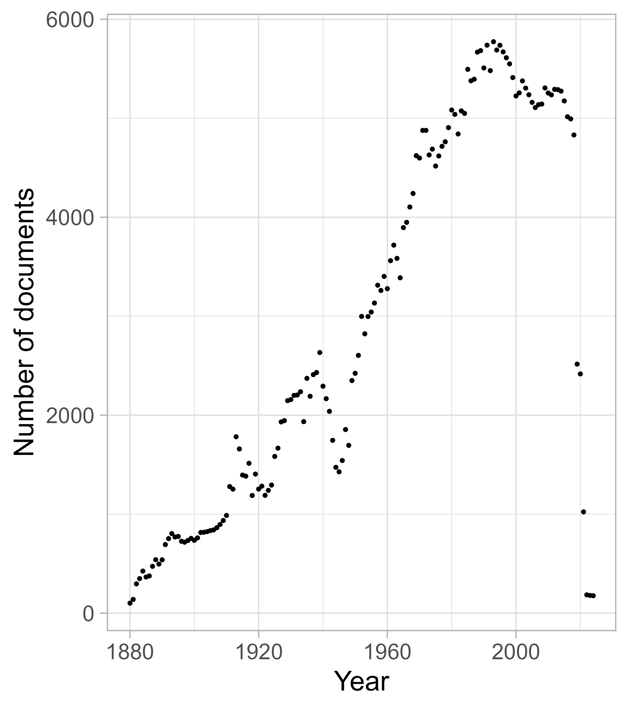
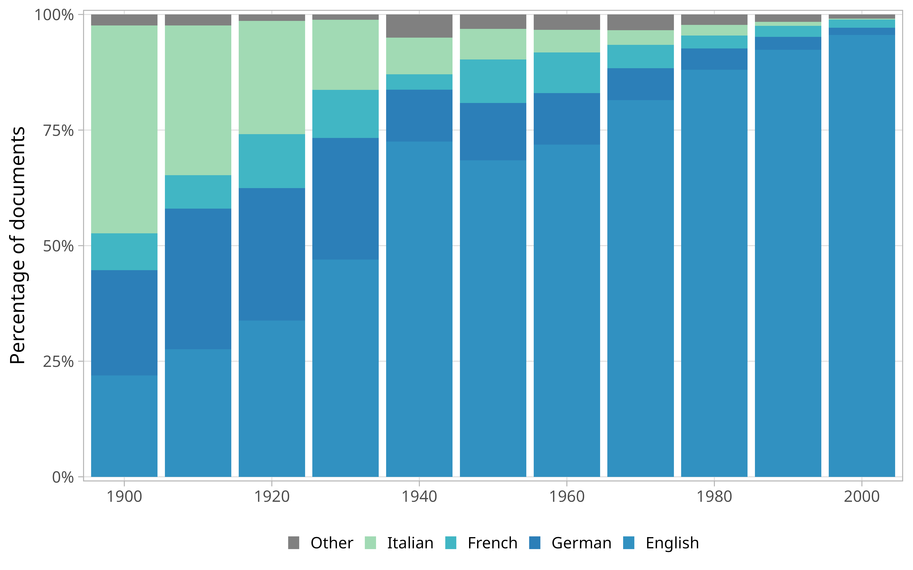
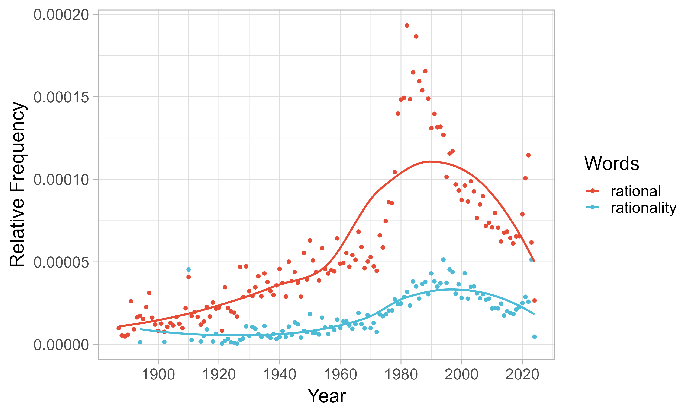
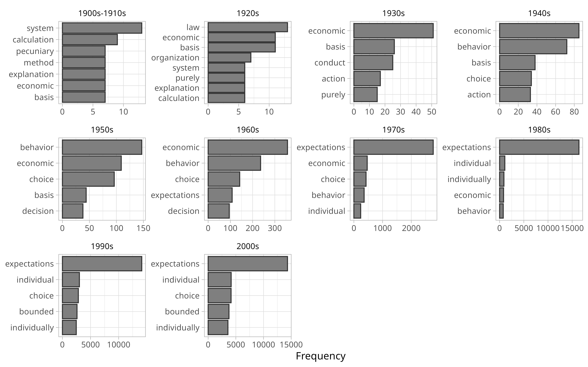
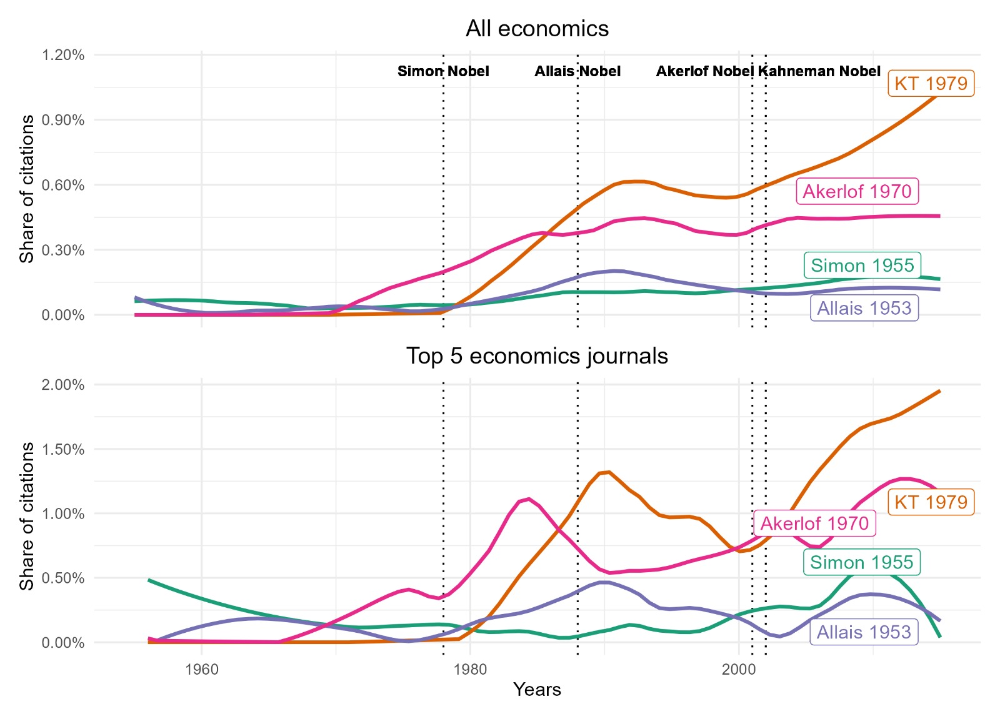
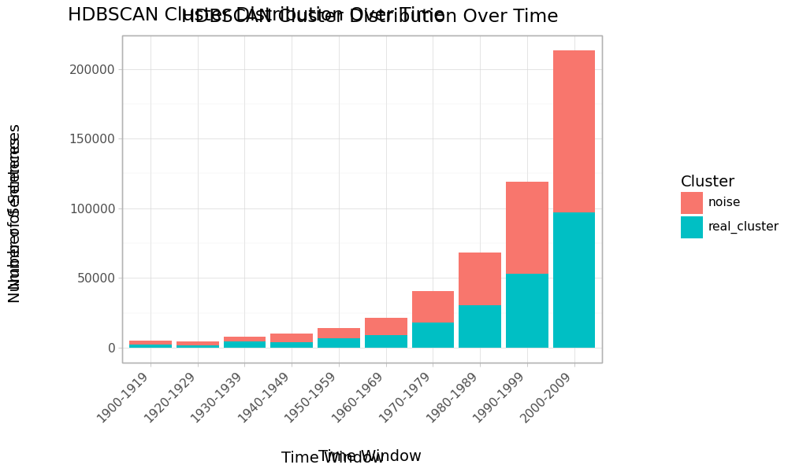
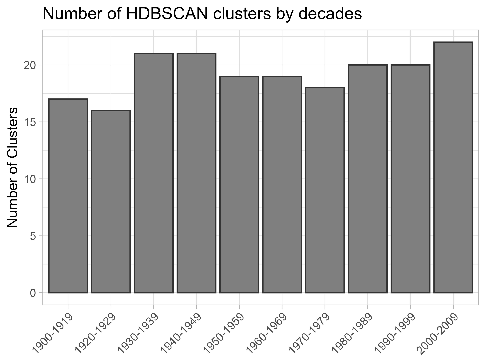

\name{Thomas Delcey\textsuperscript{a}\thanks{CONTACT Thomas Delcey. Email: thomas.delcey@ube.fr},
  Aurélien Goutsmedt\textsuperscript{b}\thanks{Email: aurelien.goutsmedt@uclouvain.be},
  and Alexandre Truc\textsuperscript{c}\thanks{Email: alexandre.truc@cnrs.fr}}
\affil{\textsuperscript{a}Université de Bourgogne
       \textsuperscript{b}UC Louvain, ISPOLE; ICHEC
       \textsuperscript{c}Université du CNRS}


\begin{abstract}
This paper provides a concrete, method-driven account of how unsupervised classification models can illuminate the history of a capacious concept in economics—rationality. We assemble a large full-text corpus paired with structured citation data and use large language models to trace semantic shifts since 1900. Combining semantic analysis with bibliometrics and network methods, we document how methodological choices shape both corpus construction and results. We show that unsupervised models, when combined with close reading, function as tools of both confirmation and discovery in the history of economics. We also release a free-open source application that allows scholars to explore the identified clusters and the indicators used to interpret them.
\end{abstract}

\begin{keywords}
rationality; economics; bibliometrics; text mining; natural language processing; large language models
\end{keywords}

\begin{jelcode}
B00; B20
\end{jelcode}


```{r}
#| echo: false
#| message: false
#| warning: false
#| label: setup

source(here::here(".", "scripts", "paths_and_packages.R"))

# load kable 

pacman::p_load(knitr, 
               kableExtra)

```

::: callout-note 
### Interactive application to explore the data 
We have developed an interactive application to explore the data and results presented in this paper. It is available at: [https://019adac8-81d4-aa0e-808c-08861c261fd2.share.connect.posit.cloud/](https://019adac8-81d4-aa0e-808c-08861c261fd2.share.connect.posit.cloud/). The first tab allows to explore the bibliometric networks; the second tab is a global summary of textual clusters.
::: 


```{r}
#| label: fetch-gdoc
#| eval: FALSE
#| echo: false
#| message: false
#| warning: false
library(googledrive)
library(rmarkdown)

drive_auth()
# Réutiliser le cache OAuth déjà créé

if (!googledrive::drive_has_token()) {
  stop(
    "Aucun jeton Google Drive trouvé. Exécute d'abord drive_auth() une fois dans la console R."
  )
}

# ID du Google Doc (⚠️ sans ?tab=... ni #heading=...)
gdoc_id <- as_id("15FmpiiUkR_PV2nqE_TDLHay4b530zdB82Gsox1vvdLU")

# Dossier cible dans le projet
docx <- here::here("paper", "gdoc.docx")
md <- here::here("paper", "gdoc.md")

# 1) Télécharger en .docx
drive_download(
  gdoc_id,
  path = docx,
  type = "application/vnd.openxmlformats-officedocument.wordprocessingml.document",
  overwrite = TRUE
)

# 2) Convertir en .md
rmarkdown::pandoc_convert(
  input = docx,
  to = "markdown",
  output = md,
  citeproc = FALSE,
)

# 3) nettoyage des antislashs indésirables (\[ \] \@)
txt <- readLines(md, warn = FALSE)
txt <- str_replace_all(txt, "\\\\([\\[\\]@>])", "\\1")
writeLines(txt, md)
```



\newpage

# References

::: {#refs}
:::

\newpage

# Figures

::: {#fig-distribution layout-nrow="2"}

{#fig-fulltextdistribution_a width="90%"}

{#fig-fulltextdistribution_b width="90%"}

Distribution of documents and languages in the full-text database over time (1900-2009).
::: 

::: {#fig-relative-frequency}



Relative frequency of terms "rational" and "rationality" in the jstor database (1900-2009). Points are the empirical data. Lines are the loess smoothed trends.
::: 

{#fig-co-occurence}


```{r}
#| echo: false
#| message: false
#| warning: false

sentences <- read_feather(here::here(
  data_path,
  "illustrative_table_closest_sentences_to_rv.feather"
))

documents <- read_feather(here::here(
  data_path,
  "illustrative_table_closest_documents_to_rv.feather"
))

# --- prepare tables ---
sentences_tbl <- sentences %>%
  filter(year == 1910) %>%
  mutate(similarity_rv = round(similarity_rv, 3)) %>%
  select(sentence, similarity_rv)

documents_tbl <- documents %>%
  filter(year == 1910) %>%
  mutate(similarity_rv = round(cosine_doc_with_rv, 3)) %>%
  select(title, authors, journal, similarity_rv)

```

```{r}
#| label: tbl-illustrative_sentences
#| tbl-cap: "Sentences from the corpus closest to the representative vector in 1910."
#| echo: false
#| message: false
#| warning: false

# === Subtable 1: Sentences
sentences_tbl %>%
  kbl(
    format = "latex",
    booktabs = TRUE,
    col.names = c("Sentence", "Cosine similarity"),
    align = c("l", "c"),
    escape = FALSE
  ) %>%
  kable_styling(font_size = 9, latex_options = c("striped")) %>%
  column_spec(1, width = "11cm") %>%
  column_spec(2, width = "2cm") 

```


```{r}
#| label: tbl-illustrative_documents
#| tbl-cap: "Documents from the corpus closest to the representative vector in 1910."
#| echo: false
#| message: false
#| warning: false

documents_tbl %>%
  kbl(
    format = "latex",
    booktabs = TRUE,
    col.names = c("Title", "Authors", "Journal", "Cosine similarity"),
    align = c("l", "l", "l", "c"),
    escape = FALSE
  ) %>%
  kable_styling(font_size = 9, latex_options = c("striped")) %>%
  column_spec(1, width = "5cm") %>%
  column_spec(2, width = "2.5cm") %>%
  column_spec(3, width = "3cm") %>%
  column_spec(4, width = "1.5cm") %>%
  # add footnote
  footnote(general = "Documents vectors are computed as the average of their sentences vectors.")


```


{#fig-rationality-paper-citations}

\newpage

# Appendix 

## Overview of the data and methods

Here, a quick summary of all the databases used and the methods used. Could be nice to have a visual representation.

## Building the full-text database

Making clear the difference between the bibliometric database and the full-text database, and the full-text database and the rationality corpus.

### Elaborating the list of economics journals

### Extraction and cleaning process for economics full texts

### Overview of the full-text database content

### Merging with the bibliometric database

## Creating a rationality corpus

### Using LLMs and sentence embeddings to represent sentences

### Building the representative vector of rationality

### Selecting full-texts and sentences related to rationality

## Text clustering methods

### Sliding time windows and HDSBSCAN

 




### Backbone networks and matching clusters over time

## Bibliographic coupling


