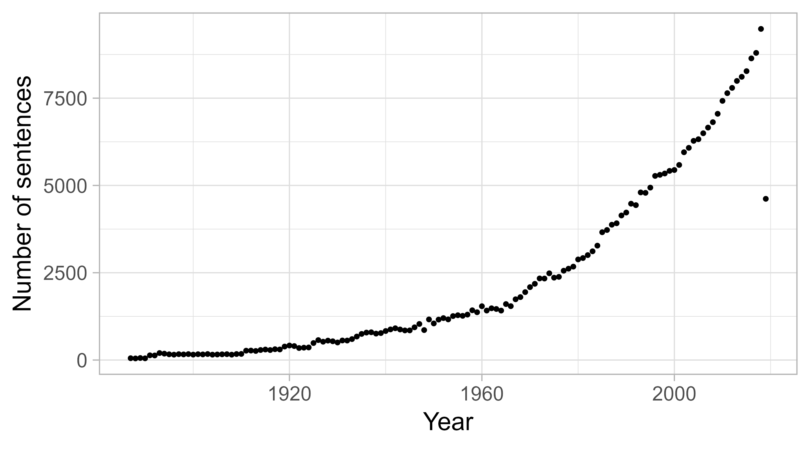
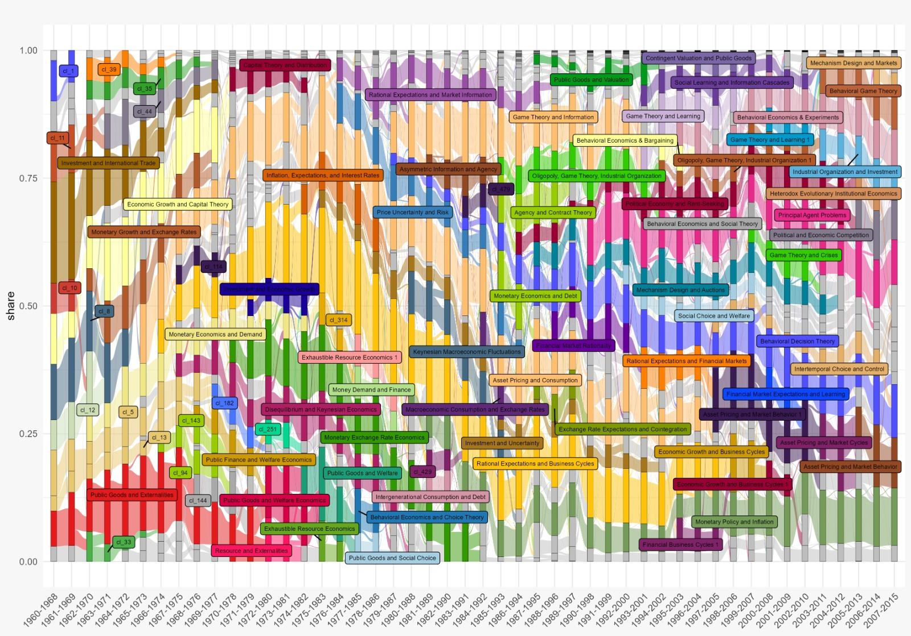
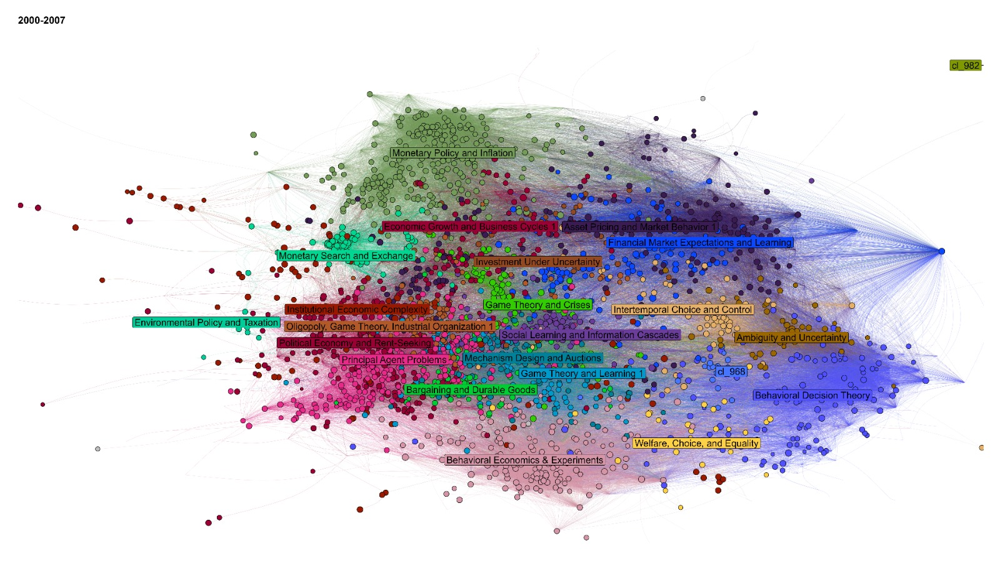

\name{Thomas Delcey\textsuperscript{a}\thanks{CONTACT Thomas Delcey. Email: thomas.delcey@ube.fr},
  Aurélien Goutsmedt\textsuperscript{b}\thanks{Email: aurelien.goutsmedt@uclouvain.be},
  and Alexandre Truc\textsuperscript{c}\thanks{Email: alexandre.truc@cnrs.fr}}
\affil{\textsuperscript{a}Université de Bourgogne
       \textsuperscript{b}UC Louvain, ISPOLE; ICHEC
       \textsuperscript{c}Université du CNRS}


\begin{abstract}
This paper offers a concrete, method-driven account of how quantitative techniques can illuminate the history of a capacious concept in economics—rationality. We assemble a large full-text corpus (nearly 300,000 economics articles since 1900) and pair it with structured citation data. On the textual side, we use large language models (LLMs) to trace semantic shifts over more than a century and to identify a corpus of texts centered on rationality, which we then analyze with bibliometrics and network methods. Our objectives are twofold: first, to provide a concrete methodological account that foregrounds the practical choices—from data collection to interpretation—that shape corpus construction and the reading of results; second, to show that unsupervised models, when combined with robustness checks and close reading, can serve as powerful tools for both confirmation and discovery in the history of economics. To ensure transparency and reuse, we release a Shiny application that exposes the indicators we rely on for qualitative interpretation and makes the workflow auditable and replicable.
\end{abstract}

\begin{keywords}
rationality; economics; bibliometrics; text mining; natural language processing; large language models
\end{keywords}

\begin{jelcode}
B00; B20
\end{jelcode}


```{r}
#| echo: false
#| message: false
#| warning: false
#| label: setup

source(here::here(".", "scripts", "paths_and_packages.R"))

# load kable 

pacman::p_load(knitr, 
               kableExtra)

```

::: callout-warning
### Warning
This is a work in progress. The discussion Section in particular will be expanded in future versions.
:::

::: callout-note 
### Interactive application to explore the data 
We have developed an interactive application to explore the data and results presented in this paper. It is available at: [https://0199205a-7b17-ab11-595d-8f12aae160dd.share.connect.posit.cloud](https://0199205a-7b17-ab11-595d-8f12aae160dd.share.connect.posit.cloud). The first tab allows to explore the bibliometric networks; the second tab is a global summary of textual clusters.
::: 


```{r}
#| label: fetch-gdoc
#| eval: FALSE
#| echo: false
#| message: false
#| warning: false
library(googledrive)
library(rmarkdown)

drive_auth()
# Réutiliser le cache OAuth déjà créé
options(
  gargle_oauth_cache = ".secrets",
  gargle_oauth_email = "thomdelcey@gmail.com"
)

if (!googledrive::drive_has_token()) {
  stop("Aucun jeton Google Drive trouvé. Exécute d'abord drive_auth() une fois dans la console R.")
}

# ID du Google Doc (⚠️ sans ?tab=... ni #heading=...)
gdoc_id <- as_id("16kdvf4TRtfYn8flrxxc60w4P-GYOOuX2Le8hSTfAzeA")

# Dossier cible dans le projet
docx <- here::here("paper", "gdoc.docx")
md   <- here::here("paper", "gdoc.md")

# 1) Télécharger en .docx
drive_download(
  gdoc_id, path = docx,
  type = "application/vnd.openxmlformats-officedocument.wordprocessingml.document",
  overwrite = TRUE
)

# 2) Convertir en .md
rmarkdown::pandoc_convert(
  input  = docx,
  to     = "markdown",
  output = md,
  citeproc = FALSE,
)

# 3) nettoyage des antislashs indésirables (\[ \] \@)
txt <- readLines(md, warn = FALSE)
txt <- str_replace_all(txt, "\\\\([\\[\\]@>])", "\\1")
writeLines(txt, md)
```




# Figures

::: {#fig-distribution layout-ncol=2}

{#fig-jstordistribution_a width="90%"}

{#fig-jstordistribution_b width="90%"}

General statistics of the JSTOR full-text database

::: 


{#fig-relative-frequency}

{#fig-co-occurence}

{#fig-embedding-example}


```{r}
#| label: tbl-example-comparison
#| tbl-cap: "The three closest sentences to the synthetic sentence for selected years."
#| echo: false 
#| warning: false
#| message: false


data <- read_feather(here::here(data_path, "top_5_sentences_to_fake_sentence.feather"))

data <- data %>%
  select(year, sentence, similarity) %>%
  filter(year %in% c(1925, 1950, 1975, 2000, 2015)) |> 
  mutate(similarity = round(similarity, 3)) |> 
  group_by(year) |>
  slice_head(n = 3) 

kbl(data, 
      format = "latex",   
      col.names = c("Year", "Sentence", "Cosine"), 
      booktabs = TRUE, 
      align = c("c", "l", "c")) %>%
  kable_styling(font_size = 7) %>%
  column_spec(1, width = "1cm") %>%
  column_spec(2, width = "10cm") %>%
  column_spec(3, width = "1cm") 

```





::: {.landscape}
{#fig-llm-alluvial}
::: 


::: landscape
```{r}
#| label: tbl-example-cluster
#| tbl-cap: "The three closest sentences from two selected clusters (1980s and 1990s)."
#| echo: false
#| warning: false
#| message: false

# helper to keep LaTeX happy (quotes/dashes) and squash whitespace
clean_tex <- function(x){
  x |>
    str_squish() |>
    str_replace_all("—|–", "--") |>
    str_replace_all("“|”", '"') |>
    str_replace_all("’", "'")
}

# ── OPTION A: hardcode your 6 rows (quick demo) ────────────────────────────────
tab2 <- tribble(
  ~decade, ~sentence, ~similarity, ~title, ~year, ~journal, ~authors,
  "1980s", "INTRODUCTION The burgeoning literature employing or alluding to the concept of rational expectations in time-dependent economic processes is strangely vague regarding possible mechanisms by which the economic agents could actually achieve the hypothesized “rationality.”", 0.856, "Rational Expectations and Learning from Experience", 1979, "The Quarterly Journal of Economics", "Stephen J. DeCanio",
  "1980s", "Perhaps the justification for this paper is that both critics and some practitioners of the rational expectations approach seem unaware of these implications.", 0.838, "Rational Expectations and Economic Thought", 1979, "Journal of Economic Literature", "Brian Kantor",
  "1980s", "A rational agent draws on an information set larger than historical prices, and expectations are rational if they depend upon the same things that economic theory suggests determines the variable.", 0.837, "A Semi-Strong Form Evaluation of the Efficiency of the Hog Futures Market", 1979, "American Journal of Agricultural Economics", "Raymond M. Leuthold, Peter A. Hartmann",
  "1990s", "This article will criticize rational expectations models for several different reasons.", 0.877, "What Is so Natural about the Natural Rate of Unemployment?", 1981, "Journal of Economic Issues", "Robert Cherry",
  "1990s", "In this article we concentrate on the role of the rational expectations hypothesis in the debate.", 0.874, "THE CONTROVERSY OVER RATIONAL EXPECTATIONS", 1981, "National Institute Economic Review", "David G. Mayes",
  "1990s", "For the purposes of this discussion, it will be assumed that economic agents form rational expectations.", 0.873, "The Market for Innovations and Short-Run Technological Change: Evidence from Egypt", 1988, "Economic Development and Cultural Change", "John M. Antle, Charles C. Crissman"
) |>
  mutate(
    sentence   = clean_tex(sentence),
    title      = clean_tex(title),
    journal    = clean_tex(journal),
    authors    = clean_tex(authors),
    similarity = round(similarity, 3)
  )

# order columns and render
out <- tab2 %>%
  select(
    Sentence = sentence, Similarity = similarity, Title = title,
    Year = year, Journal = journal, Authors = authors, decade
  )

kbl(out %>% select(-decade),
    format = "latex", booktabs = TRUE, escape = TRUE,
    align = c("l","c","l","c","l","l")) %>%
  kable_styling(font_size = 7) %>%
  column_spec(1, width = "8cm") %>%   # Sentence
  column_spec(3, width = "5cm") %>%   # Title
  column_spec(5, width = "3.5cm") %>% # Journal
  column_spec(6, width = "3.5cm") %>% # Authors
  pack_rows(index = table(out$decade)) %>%
  footnote(
    general = "Cosine similarities from the representative vectors; three nearest sentences per selected cluster/decade.",
    threeparttable = TRUE
  )
``` 
::: 


{#fig-rationality-paper-citations}

::: {.landscape}
{#fig-biblio-alluvial}
:::

::: {.landscape}
{#fig-biblio-network-example width="100%"}
:::

# References 
