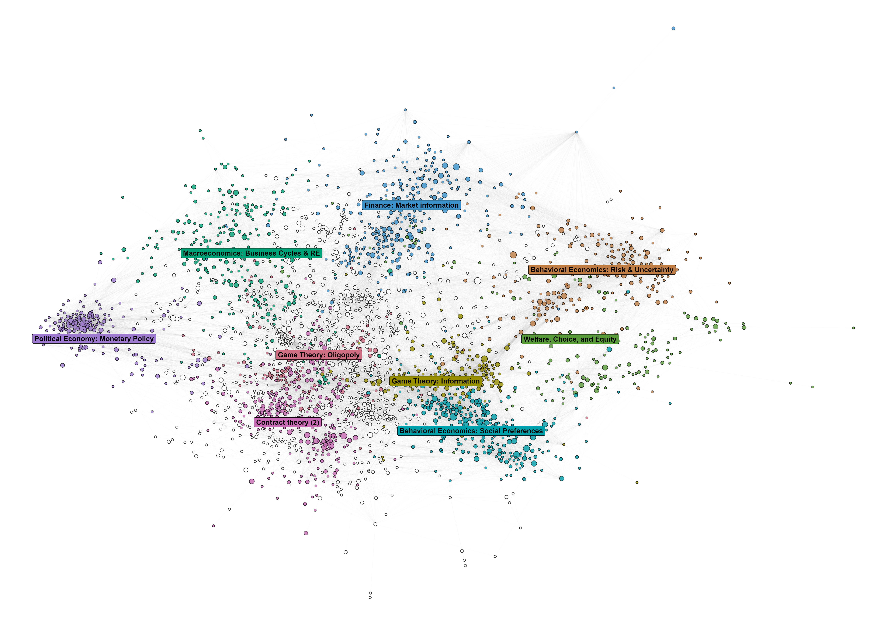
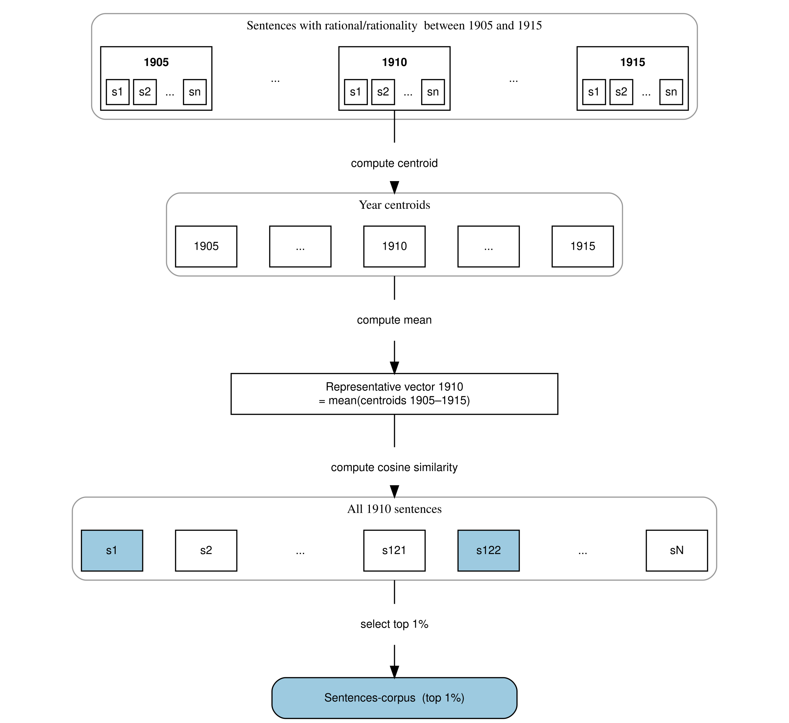

\name{Thomas Delcey\textsuperscript{a}\thanks{CONTACT Thomas Delcey. Email: thomas.delcey@ube.fr},
Aurélien Goutsmedt\textsuperscript{b}\thanks{Email: aurelien.goutsmedt@uclouvain.be}, 
and Alexandre Truc\textsuperscript{c}\thanks{Email: alexandre.truc@cnrs.fr}}


\affil{\textsuperscript{a}Université de Bourgogne
       \textsuperscript{b}UC Louvain, ISPOLE; ICHEC Brussels
       \textsuperscript{c}Université Côte d'Azur}

\begin{abstract}
This article demonstrates how unsupervised quantitative methods can enrich the history of economic thought. Using the largest English-language corpus ever assembled for the field—nearly 290,000 economics journal articles from 1900 to 2009 with citation data—we analyze the evolution of the concept of rationality. Combining large language model–based semantic analysis with bibliometric and network methods, we identify and cluster discussions of rationality across time and scales, such as the circulation of bounded rationality and the emergence of behavioral economics. We provide an open-source interactive tool to support transparency and reuse.
\end{abstract}

\begin{keywords}
rationality; economics history; bibliometrics; behavioral economics; natural language processing; large language models
\end{keywords}

\begin{jelcode}
B00; B20
\end{jelcode}


```{r}
#| echo: false
#| message: false
#| warning: false
#| label: setup

source(here::here(".", "scripts", "paths_and_packages.R"))

# load kable 

pacman::p_load(knitr,
               kableExtra,
              #  DiagrammeR, 
              #  DiagrammeRsvg, 
              #  rsvg,
               xlsx)

```

```{r}
#| label: fetch-gdoc
#| eval: FALSE
#| echo: false
#| message: false
#| warning: false
library(googledrive)
library(rmarkdown)

drive_auth()
# Réutiliser le cache OAuth déjà créé

if (!googledrive::drive_has_token()) {
  stop(
    "Aucun jeton Google Drive trouvé. Exécute d'abord drive_auth() une fois dans la console R."
  )
}

# ID du Google Doc (⚠️ sans ?tab=... ni #heading=...)
gdoc_id <- as_id("1ZzhcuQzZt7t3SGbB-Wwq5zJ-8zb9v5pmNhn5FWk_AU8")

# Dossier cible dans le projet
docx <- here::here("paper", "gdoc.docx")
md <- here::here("paper", "gdoc.md")

# 1) Télécharger en .docx
drive_download(
  gdoc_id,
  path = docx,
  type = "application/vnd.openxmlformats-officedocument.wordprocessingml.document",
  overwrite = TRUE
)

# 2) Convertir en .md
rmarkdown::pandoc_convert(
  input = docx,
  to = "markdown",
  output = md,
  citeproc = FALSE,
)

# 3) nettoyage des antislashs indésirables (\[ \] \@)
txt <- readLines(md, warn = FALSE)
txt <- str_replace_all(txt, "\\\\([\\[\\]@>])", "\\1")
writeLines(txt, md)
```

```{r}
#| echo: false
#| message: false
#| warning: false
#| output: false
nb_sentences_top_1_percent <- read_feather(
  here::here(
    data_path,
    "top1pct_sentences_by_year.feather"
  ),
  as_data_frame = FALSE
) %>%
  nrow()

nb_articles_meta_corpus <- read_feather(
  here::here(
    data_path,
    "metadata_maintext.feather"
  ),
  as_data_frame = FALSE
) %>%
  nrow()


nb_articles_top_10_percent <- read_feather(
  here::here(
    data_path,
    "fulltexts_cosine_sim_with_rv.feather"
  ),
  as_data_frame = FALSE
) %>%
  slice_max(cosine_doc_with_rv, prop = 0.1, with_ties = FALSE) %>%
  collect() %>%
  nrow()

gc() # remove large objects from memory

sentences <- read_feather(here::here(
  data_path,
  "illustrative_table_closest_sentences_to_rv.feather"
))

documents <- read_feather(here::here(
  data_path,
  "illustrative_table_closest_documents_to_rv.feather"
))

wos_decade <- readRDS(file.path(data_path, "wos_match_by_decade.rds"))
ov <- readRDS(file.path(data_path, "corpus_overlap_stats.rds"))

# --- prepare tables ---
sentences_tbl <- sentences %>%
  filter(year %in% c(1910, 1950, 2000)) %>%
  mutate(similarity_rv = round(similarity_rv, 3)) %>%
  arrange(year, desc(similarity_rv))

sentences_grp <- sentences_tbl %>%
  group_by(year) %>%
  summarise(n = n()) %>%
  mutate(end = cumsum(n), start = end - n + 1)

sentences_tbl <- sentences_tbl %>%
  select(sentence, similarity_rv)

documents_tbl <- documents %>%
  filter(year %in% c(1910, 1950, 2000)) %>%
  mutate(similarity_rv = round(cosine_doc_with_rv, 3)) %>%
  arrange(year, desc(similarity_rv))

documents_grp <- documents_tbl %>%
  group_by(year) %>%
  summarise(n = n()) %>%
  mutate(end = cumsum(n), start = end - n + 1)

documents_tbl <- documents_tbl %>%
  select(title, authors, journal, similarity_rv)
```



# References

::: {#refs}
:::

\clearpage 


# Figures  

::: {#fig-distribution layout-nrow="2"}

{#fig-fulltextdistribution_a width="100%"}

{#fig-fulltextdistribution_b width="100%"}

Distribution of documents and languages in the meta-corpus over time (1900-2009). Languages are identified by the sources. 
::: 


```{r}
#| label: tbl-illustrative_sentences
#| tbl-cap: "Sentences from the corpus closest to the representative vector in 1910, 1950, and 2000."
#| echo: false
#| message: false
#| warning: false

# === Subtable 1: Sentences
sentences_tbl %>%
  kbl(
    format = "latex",
    booktabs = TRUE,
    col.names = c("Sentence", "Cosine similarity"),
    align = c("l", "c"),
    escape = FALSE
  ) %>%
  kable_styling(font_size = 9, latex_options = c("striped")) %>%
  column_spec(1, width = "11cm") %>%
  column_spec(2, width = "2cm") %>%
  pack_rows("1910", sentences_grp$start[1], sentences_grp$end[1]) %>%
  pack_rows("1950", sentences_grp$start[2], sentences_grp$end[2]) %>%
  pack_rows("2000", sentences_grp$start[3], sentences_grp$end[3])

```

```{r}
#| label: tbl-illustrative_documents
#| tbl-cap: "Documents from the corpus closest to the representative vector in 1910, 1950, and 2000."
#| echo: false
#| message: false
#| warning: false

documents_tbl %>%
  kbl(
    format = "latex",
    booktabs = TRUE,
    col.names = c("Title", "Authors", "Journal", "Cosine similarity"),
    align = c("l", "l", "l", "c"),
    escape = FALSE
  ) %>%
  kable_styling(font_size = 9, latex_options = c("striped")) %>%
  column_spec(1, width = "5cm") %>%
  column_spec(2, width = "2.5cm") %>%
  column_spec(3, width = "3cm") %>%
  column_spec(4, width = "1.5cm") %>%
  pack_rows("1910", documents_grp$start[1], documents_grp$end[1]) %>%
  pack_rows("1950", documents_grp$start[2], documents_grp$end[2]) %>%
  pack_rows("2000", documents_grp$start[3], documents_grp$end[3]) 

```


::: {#fig-relative-frequency}

{width="100%"}

Relative frequency of terms "rational" and "rationality" in the meta-corpus (1900-2009). Points are the empirical data. Lines are the loess smoothed trends.
::: 


::: {#fig-co-occurence}

{width="100%"}

Five most frequent neighbor terms of "rational" and "rationality" by decade. We search and select $n-1$ and $n+1$ neighbors of "rational" and "rationality" in each sentence. We remove stop words and compute the most frequent neighbors by decade. We merge 1900 and 1910 decades because of the low number of sentences containing "rational" or "rationality" before 1910. 

::: 

::: {#fig-rationality-paper-citations}

{width="100%"}

**Relative citation of a selection of seminal papers on behavioral economics.** 

::: 


::: {#fig-capture-static-textual-network layout-nrow="1"}

{width="100%"}

Network of sentence clusters discussing rationality in economics journals (1900–2009), with a force-directed layout emphasizing thematic proximity. Each node is a group of sentences discussing rationality in a similar way, identified within a given decade. Node size reflects how many sentences belong to that group. Colors indicate broader thematic clusters that persist across decades — nodes sharing the same color address rationality in comparable ways across time. See the appendix for the full methodology. Labels are manually assigned by the authors after qualitative inspection of each cluster. In this visualisation, we applied a force-directed layout to position nodes with similar connections closer together, which helps to visually identify clusters of related discussions. We strongly advise readers to explore the networks via the [companion application](https://019adac8-81d4-aa0e-808c-08861c261fd2.share.connect.posit.cloud/).
::: 

::: {#fig-capture-dynamic-textual-network layout-nrow="1"}

{width="100%"}

Temporal evolution of sentence clusters discussing rationality in economics journals (1900–2009).This figure is similar to @fig-capture-static-textual-network but with a different layout to emphasize the temporal dimension. In this visualisation, we group clusters by decade along the x-axis (1900–1919, 1920–1929, ... , 2000–2009) and group thematically similar clusters along the y-axis, making it easier to follow how topics evolve over time. We strongly advise readers to explore the networks via the [companion application](https://019adac8-81d4-aa0e-808c-08861c261fd2.share.connect.posit.cloud/).
::: 


::: {#fig-capture-dynamic-bibliometric-network layout-nrow="1"}

{width="100%"}

A bibliographic coupling network of articles discussing rationality in economics journals (1994–2001). This figure shows a snapshot of the dynamic bibliographic coupling networks built on the articles-corpus. Each node is an article from the 1994–2001 time window. Articles are connected when they cite similar references---a proxy for shared intellectual background. Colors indicate communities of articles that recurrently cluster together across consecutive 8-year time windows. Uncolored nodes belong to communities that are too small or too short-lived to be considered substantive. Labels are manually assigned by the authors after qualitative inspection of each cluster. The spatial layout positions articles with similar citation profiles in close proximity. See the appendix for the full methodology. We strongly advise readers to explore the networks via the [companion application](https://019adac8-81d4-aa0e-808c-08861c261fd2.share.connect.posit.cloud/).
::: 


\clearpage 

# Appendix

@fig-method-schema-general summarizes the general workflow of our method. The goal of this appendix is to provide the general rationale and workflow of our methods. It requires technical knowledge of natural language processing and bibliometric methods. Since fulltexts are not publicly available, we cannot share a full replication package and, in particular, the data and the code to build the meta-corpus are not available. The rest of the code is available in the GitHub repository: [https://github.com/agoutsmedt/ejhet_quanti_method](https://github.com/agoutsmedt/ejhet_quanti_method). We refer to the companion application for the detailed results of the clustering analyses. The application can be downloaded from the GitHub repository: [https://github.com/tdelcey/ejhet_quanti_method_app](https://github.com/tdelcey/ejhet_quanti_method_app) and run locally. However, to facilitate access for non-technical users, we also provide a public access to the application at the following link: [https://019adac8-81d4-aa0e-808c-08861c261fd2.share.connect.posit.cloud/](https://019adac8-81d4-aa0e-808c-08861c261fd2.share.connect.posit.cloud/). 

## Building the meta-corpus

```{r}
#| label: load-metadata
#| echo: false
#| message: false
#| warning: false

path <- file.path(data_path, "metadata_maintext.feather")
metadata <- read_feather(path)

metadata_1960_2009 <- metadata %>%
  filter(year >= 1960)
```

```{r}
#| label: create-list-journals
#| echo: false
#| message: false
#| warning: false
#| eval: false

list_journal <- metadata %>%
  distinct(journal) %>%
  arrange(journal)

# save list of journals in xlsx
xlsx::write.xlsx(
  list_journal,
  file = here::here("paper", "list_of_journals.xlsx"),
  sheetName = "Journals",
  row.names = FALSE
)

```

### Sources 

The meta-corpus is built from three main sources: JSTOR, Elsevier and ISTEX. The main source is JSTOR, which provides the largest coverage of historical economics journals including journals from various private editors and associations (e.g., _American Economic Review_). However, important economics journals published by Elsevier are missing from JSTOR. We therefore complement JSTOR with documents from SCOPUS journals using two supplementary sources: Elsevier and ISTEX. We used the Elsevier API to access the full-texts of documents from Elsevier journals, that were available from 1997 onwards. We used the ISTEX API to access the full-texts of documents from Elsevier journals that were available before 1997.

### Selecting economics documents

To identify _economics_ documents, we use a journal-based approach. We build a list of economics journals and then retrieve all documents published by these journals in our sources. We identify `r dplyr::n_distinct(metadata$journal)` unique journals. The list of journals is available in the supplementary material. To build this list, we first use the sources' own classification of journals and retrieve all journals marked as economics. We review them manually to ensure they are (i) economic oriented journals and (ii) peer-reviewed journals. We also filtered out very recent journals (less than 20 years old). The rationale was to limit the short-time effect of small journals and focus on journals that have a long-term influence on the field. We then queried each source to retrieve all available documents published by these journals between 1900 and 2009. We keep only documents classified by our sources as (i) written in English and (ii) research articles (i.e., we remove editorials, book reviews, etc.). The filtering of research articles draws on JSTOR's and Scopus' own classifications, supplemented by some additional filtering from ourselves. Despite these safeguards, a perfectly clean restriction to research articles was not feasible, and some residual "non-article" items likely remain. This process results in a total of `r nb_articles_meta_corpus |> formatC(format = "d", big.mark = ",") ` documents that represent our meta-corpus. @tbl-database-sources summarizes the sources of our meta-corpus. 

### Cleaning the full-texts 

Each source provides documents at different levels of granularity: Elsevier provides paragraph-level data, JSTOR page-level data, while ISTEX provides no such segmentation. We thus paste together the full-texts from each source at the document level to harmonize the unit of analysis. Elsevier provides structured full-texts with minimal noise. In contrast, the full-texts from JSTOR and ISTEX are raw OCR with significant noise, including OCR errors and paratextual material (e.g., affiliations, acknowledgements, headers, references). We apply basic cleaning steps based on RegEx patterns to remove those paratextual elements. However, cleaning full-texts at scale is computationally intensive and not easily scalable and some noise inevitably remains in the cleaned full-texts (we describe in the next section how we deal with this noise in the clustering analysis).

### Enriching with citation data from Web of Science

To perform our bibliometric analysis, we enrich our fulltexts with citations from Web of Science (WOS). We match our fulltexts database and WOS data based on their metadata (e.g., journal, year, volume, first page). We use metadata-based matching rather than DOIs because many documents, especially older ones, do not have DOIs. Because metadata might slightly differ across our sources, we also applied combinations of metadata rather than exact matches on all metadata fields. Our algorithm also includes fuzzy matching to account for OCR errors in titles and journals. We achieve an overall match rate of `r round(mean(!is.na(metadata$id_wos_matched)) * 100, 1)`\% across the full database. Column "WOS matched (%)" in @tbl-database-sources indicates the proportion of documents successfully matched to WOS records for each source and each decade. @tbl-wos-match-decade details the WOS match rate by decade. Coverage is near zero before 1940, as WOS records are sparse for this period. From the 1950s onwards, match rates stabilise between 60% and 68%. 

## Building the sentences and documents corpora

### Cleaning sentences before computation

In order to compute sentence vectors, we first need to split the full-texts into sentences. We use `sent_tokenize` from the NLTK Python library. Sentence segmentation may amplify noise in OCR-based texts from JSTOR and ISTEX, which often contain punctuation and capitalization errors. Given the size of the corpus---more than 61 million sentences---errors from the OCR or sentence segmentation cannot be fully removed at scale. We only remove sentences for which the segmentation is almost certainly incorrect and provide no information, i.e., sentences that contain less than 20 characters, less than three words, or contain more than 50\% digits. Remaining errors are expected to be averaged out by the clustering analysis.

A more serious issue is the presence of paratextual sentences (e.g., affiliations, acknowledgements, headers, references) in JSTOR and ISTEX OCR full-texts. These sentences introduce systematic noise that can affect clustering analysis. For instance, because references often contain similar wording (e.g., "Journal of...", "Vol.", "pp.", etc.), they tend to cluster together in the vector space. We use this property at our advantage to remove such noise. Because paratextual sentences tend to be semantically similar, they form dense regions in the vector space, which we exploit to identify and remove them. We first define four categories of noisy sentences: affiliations, acknowledgements, headers, references. For each category, we use regular expressions to identify a set of sentences that likely belong to this category. We compute (i) the centroid vector of these noisy sentences and (ii) the cosine similarity between those centroids and each sentence vectors from our meta-corpus. We remove sentences from our corpus that are too close to the centroids of noisy sentences. We exclude sentences flagged as noise from all subsequent analyses^[We determine the thresholds for each category of noise by using Youden's J statistic and by manually inspect sentences around the threshold.]


### Compute sentence vectors

We compute sentence vectors with Sentence-BERT, using the pretrained model [\texttt{sentence-transformers/all-mpnet-base-v2}](https://huggingface.co/sentence-transformers/all-mpnet-base-v2). This model is widely used in natural language processing applications and has been shown to perform well for semantic similarity tasks. We use the `sentence-transformers` Python library to compute the vectors. 


We introduce some notation to describe the computation of sentence vectors and representative vectors presented in the next section. Let's denote the set of sentences in our meta-corpus as $\mathcal{S}$. For each sentence $s \in \mathcal{S}$, we compute its vector $v_s \in \mathbb{R}^{768}$ using the Sentence-BERT model.

### Compute the representative vectors 

The computation of the representative vectors is presented schematically in @fig-rv-method-diagram. Let $\mathcal{S}_t^R$ denote the set of sentences in year $t$ that contain "rational" or "rationality".^[We filter the text using the RegEx: `\brational(?:ity)?\b`.] We compute the centroid $\bar{v}_t^R$ of the vectors of these sentences as follows:
$$\bar{v}_t^R = \frac{1}{|\mathcal{S}_t^R|} \sum_{s \in \mathcal{S}_t^R} v_s^R$$

We define the representative vector for year $t$, denoted as $RV_t$, as the unweighted average of the centroids of the 11-year window centered on $t$:

$$RV_t = \frac{1}{11} \sum_{i=-5}^{5} \bar{v}_{t+i}^R$$

We use a window of 11 years to avoid short-term fluctuations and to capture more stable semantic patterns. We use an unweighted moving average to give equal importance to all years rather than giving more weight to recent years with more sentences.

### Building the sentences-corpus and the articles-corpus

To build the sentences-corpus, we select sentences that are semantically close to the representative vector of their year, in terms of cosine similarity. For each year $t$, we thus compute the cosine similarity between the vector of sentences in $\mathcal{S}_t$ and the representative vector $RV_t$. For each year $t$, we then retain the top 1\% most similar sentences. We thus obtain, the sentences-corpus, a set of sentence $\mathcal{S}_t^{RV}$ for each year $t$ that are the most semantically similar to the representative vector of their year. _Importantly, $\mathcal{S}_t^{RV}$ and $\mathcal{S}_t^R$ are distinct sets._ The sentences in $\mathcal{S}_t^{RV}$ are likely to contain "rational" or "rationality" but this is not a requirement. 

Similarly, to build the articles-corpus, we select documents that are semantically close to the representative vector of their year, in terms of cosine similarity. Because $v_s$ is a sentence-level vector, we first compute a document-level vector by averaging the vectors of all sentences in the document. Let's denote $\mathcal{D}$ as the set of documents $d$ in our meta-corpus, and $\mathcal{S}_d$ the set of sentences in document $d$. We compute the vector of each document $d$ as follows:
$$v_d = \frac{1}{|\mathcal{S}_d|} \sum_{s \in \mathcal{S}_d} v_s$$

This results in $v_d$, a single 768-dimensional vector for each document. We then compute the cosine similarity between $v_d$ and the representative vector $RV_t$ of the document's publication year $t$. We retain the top 10\% most similar documents across the full period, yielding the articles-corpus $\mathcal{D}^{RV}$. Unlike the sentences-corpus, where the 1\% threshold is applied year by year to avoid over-representing recent years, the articles-corpus uses a global threshold.

The 1\% and 10\% threshold are of course debatable. It balances competing objectives. On the one hand, we want to capture a sufficient number of sentences and documents to represent the diversity of ways rationality is discussed in each year. On the other hand, we want to focus on sentences and documents that are strongly related to rationality and we want to limit the computational cost of subsequent analyses. There is clear room for improvement to choose less arbitrary thresholds.

### Overlap between sentences and documents corpora

@tbl-corpus-overlap reports the size of $\mathcal{S}_t^{RV}$, the sentence-corpus, and $\mathcal{D}^{RV}$ the articles-corpus, as well as the extent of their overlap. By overlap, we mean the number of articles that are in both corpora. An article is in the sentences-corpus if at least one of its sentences is in $\mathcal{S}_t^{RV}$ and, of course, an article is in the articles-corpus if it is in $\mathcal{D}^{RV}$. The sentences-corpus and the articles-corpus share `r formatC(ov$n_overlap_articles, format = "d", big.mark = ",")` articles. Almost all documents in the articles-corpus are also in the sentences-corpus (i.e., `r ov$pct_overlap_in_articles_corpus`\%) but documents with sentences in the sentences-corpus are much less likely to be in the articles-corpus (i.e., `r ov$pct_overlap_in_sentences_corpus`\%). This is expected given the different selection criteria: the sentences-corpus are drawn from any documents, not only the 10\% most similar to the representative vector. However, despite representing only `r ov$pct_overlap_in_sentences_corpus`% of the articles in the sentences-corpus, these shared articles account for `r ov$pct_overlap_sentences`% of its sentences. In other words, sentences from articles in the article-corpus are over-represented in the sentences-corpus.

## Semantic clusters 

This section details the text clustering methods used on the sentences-corpus, $\mathcal{S}_t^{RV}$. We adopt a dynamic approach: we apply clustering algorithms for each decade and then we link clusters across decades to recover intertemporal semantic clusters. This is a common approach in the literature on semantic shift since most corpora are growing over time: applying a clustering algorithm on the whole corpus would lead to clusters that are mostly driven by recent years [@montanelliSurvey2024]. Regarding the choice of clustering methods, we followed the workflow of @alammarHandsOn2024 and use HDBSCAN. However, the choice of clustering methods is not a central contribution of our paper and we do not claim that it is the only choice and other algorithms might be worth exploring (e.g., k-means, affinity propagation, etc.). We chose HDBSCAN because they are widely used in the natural language processing community and have been shown to perform well for clustering semantic vectors. 


### UMAP and HDBSCAN

UMAP is a dimensionality reduction technique that project the high-dimensional sentence vectors into a lower-dimensional space while preserving their information. Dimensionality reduction techniques like UMAP helps to improve the performance of clustering algorithms [e.g., @benzMapping2025]. Intuitively, the rationale for using UMAP is that high-dimensional spaces are often sparse, making clustering algorithms like HDBSCAN less effective. We first project the 768-dimensional sentence vectors to a 100-dimensional UMAP space (metric = cosine, n_neighbors = 15, min_dist = 0.0). From each $v_s \in \mathbb{R}^{768}$ and $s \in \mathcal{S}_t^{RV}$, we obtain $u_s \in \mathbb{R}^{100}$. To fit UMAP, we use a sampling strategy that keeps all pre-1980 sentences and caps the post-1980 years at 30,000 sentences each. The rationale is to avoid over-representing recent years in the UMAP fit. 

We then apply HDBSCAN to identify clusters in the UMAP space for each decade.^[We define a first time windows of two decades (1900--1919)---because of the low number of sentences before 1920---followed by standard decades until 2009.] For each window, we run HDBSCAN on the UMAP coordinates. HDBSCAN's hyperparameters, in particular `min_cluster_size` and `min_samples`, influence the granularity of the clusters. We set `min_cluster_size = max(20, 1% of total sentences in the window)` and `min_samples = 1`. These parameters were selected after manual inspection of cluster interpretability. @fig-hdbscan_cluster_distribution_over_time shows the distribution of noisy vs clustered sentences and the number of clusters identified per time window by HDBSCAN.

### Merging clusters over time

We choose a network-based approach to link clusters across decades. This approach handles many-to-many relationships between decade-level clusters---a semantic cluster may gradually merge with or split into multiple clusters over time. It is also consistent with the network-based approach applied to the articles-corpus. 

We represent each cluster identified by HDBSCAN as a node in a network and edges are the cosine similarity between all cluster centroids. This gives us a weighted network where nodes are decade specific clusters and edges are cosine similarities between their centroids. We keep only the most significant links using the LANS (Local Adaptive Network Sparsification, `alpha = 0.02`) [@domagalskiBackbone2021].^[LANS retains edges that represent statistically significant similarities relative to a null model in which the weights are randomly distributed among the node's edges.] We apply the Leiden community detection (resolution = 2) on the backbone network. Intuitively, clusters that are strongly connected in the backbone network are grouped into intertemporal meta-clusters. @fig-capture-static-textual-network and @fig-capture-dynamic-textual-network are an example of the resulting network. 

## Bibliometric data and methods

This section details the bibliographic coupling and community detection workflow. The approach is similar to recent studies in the history of economics [@claveauMacrodynamics2016; @goutsmedtIndependent2023; @camilottoNavigating2023] and consist in building overlapping bibliographic coupling networks over time, applying community detection to identify research communities, and then linking communities across time to identify intertemporal research communities. We apply this approach to the articles-corpus, $\mathcal{D}^{RV}$, which is a subset of our meta-corpus that contains the 10\% most semantically similar documents to the representative vector of their year.

### Dynamic coupling networks 

Networks were constructed using bibliographic coupling, where two publications are linked if they cite common references. This approach identifies articles that draw on similar intellectual foundations, revealing thematic communities within the literature. Raw common references counting can be misleading, as articles that cite many references overall are more likely to share citations by chance and references that are highly cited are also overall more likely to link to articles by chance. To weight shared references between two articles, we use the coupling strength method from [@shenRefinedMethodComputing2019]. Coupling strength weighs both the size of the reference list of articles and the number of overall citations of each reference to overweight significant co-occurrences of references.^[ Statistical determination of edges are best options but are computationally unfeasible given the size of our networks] 

To study the evolution of networks over time, we employed a dynamic windowing approach:

* Time window: 8 years 
* Overlapping windows: windows overlap to allow smooth temporal transitions (1980-1987, 1981-1988, etc.)
* Edge threshold: articles are only connected if they have at least 2 shared references

For each time window, we removed isolated articles (articles with no connections) and small components (connected groups of articles disconnected from the main network) ensuring that the analysis focused on the coherent and relevant literature.

### Clustering algorithm, spatilization, and intertemporal analysis

Communities within each network were identified using the Leiden algorithm with modularity optimization [@traagLouvain2019]. This algorithm identify groups of articles that are have strong connections to each others, but few connections to the rest of the networks (i.e., relevant sub-groups of articles across the main network).

To identify the most relevant clusters across multiple networks, we made to an intertemporal analysis of our cluster. To trace the evolution of research communities over time, we linked clusters across consecutive time windows. Communities were considered continuous if they shared at least 50.1% of their members across two time windows. For example, if a cluster in the 1990-1997 network is made of similar articles as another cluster in the 1991-1998 network, the cluster are identified as the same one. This approach allows us to follow how research communities emerge, grow, split, merge, or decline over the 50-year period.

For visualization and interpretation, see the application.^[ [https://019adac8-81d4-aa0e-808c-08861c261fd2.share.connect.posit.cloud/](https://019adac8-81d4-aa0e-808c-08861c261fd2.share.connect.posit.cloud/)] We focused on substantive communities using two criteria:

* Temporal persistence: Communities must appear in at least 2 time windows
* Size significance: Communities must represent at least 5% of the network in their peak window

Smaller or more transient clusters are uncolored in visualizations to emphasize the major research streams.

To visualize individual networks, articles (nodes) are color-coded by intertemporal clusters and spatialized in a two-dimensional space using the Force Atlas 2 algorithm [@jacomy_ForceAtlas2ContinuousGraph_2014]. This layout enhances readability by positioning similar articles in close proximity. However, these visualizations are intended as heuristic aids rather than primary analytical tools. The study’s findings are grounded in quantitative network metrics and detailed tables rather than visual analysis.


### Characterizing Research Communities

We generated an automated exploratory dashboard in addition to our app to bridge the gap between the large-scale quantitative network analysis and the qualitative interpretation of research communities.

An Alluvial Diagram is generated to map the flow of these clusters over time. This visualization allows us to trace the genesis, growth, merging, splitting, and decline of specific intellectual communities across decades. We also track this transformations in our app.

For each intertemporal clusters and also for each clusters in each temporal windows, we compiled: 

* The most distinctive words in the articles of the clusters in titles with TF-IDF. The TF-IDF algorithm identifies the most distinctive unigrams and bigrams for each cluster relative to the rest of the network.
* The most cited articles in the network by other articles in the network
* The most cited references (articles and books separately)
* The journals in which the articles are published 
* The most cited journals in references
* The most productive authors

Finally, while we are able to approximate how clusters are related to each others by their spatial position, we also generates a network overview and heat maps of inter-cluster relationships for each time window. Instead of looking at individual articles, the heat map treats entire clusters as nodes, calculating the normalized edge weight (cosine measure) between them based on the similarity of their shared references.

\newpage 


## Appendix Tables and Figures


::: {#fig-method-schema-general layout-nrow="2"}

{width="100%"}

General workflow of the methods used in the paper. Orange boxes represent data sources. Blue boxes represent used corpora. White boxes are transformation steps. Arrows indicate the flow of data and transformations. 
::: 

::: {#fig-rv-method-diagram layout-nrow="1"}

{width="100%"}

Zoom on the construction of the representative vector of rationality and how it is used to build a corpus (here the sentences-corpus). White boxes are transformation steps. Arrows indicate the flow of data and transformations. 

::: 


```{r}
#| echo: false
#| label: tbl-database-sources
#| tbl-cap: "Sources of the meta-corpus (1900--2009)."

metadata_source <- metadata %>%
  mutate(
    source = case_when(
      str_detect(id, "jstor")                ~ "JSTOR",
      str_detect(id, "SCOPUS") & year > 1996 ~ "Elsevier",
      TRUE                                   ~ "ISTEX"
    )
  ) %>%
  group_by(source) %>%
  mutate(
    "Format" = case_when(
      source == "Elsevier" ~ "XML",
      TRUE ~ "raw OCR"
    ),
    "Unit of text" = case_when(
      source == "JSTOR" ~ "page",
      source == "Elsevier" ~ "paragraph",
      TRUE ~ "full text"
    )
  )

table_source <- metadata_source %>%
  group_by(source) %>%
  summarise(
    n_documents = n(),
    n_journals = dplyr::n_distinct(journal),
    `Unit of text` = first(`Unit of text`),
    Format = first(Format),
    pct_wos_matched = mean(!is.na(id_wos_matched)) * 100,
    pct_wos_matched = round(pct_wos_matched, 1)
  )

table_source %>%
  kbl(
    format = "latex",
    booktabs = TRUE,
    col.names = c(
      "Source",
      "Documents",
      "Journals",
      "Unit of text",
      "Format",
      "WOS matched (\\%)"
    ),
    align = c("l", "c", "c", "c", "c", "c"),
    escape = FALSE
  ) %>%
  kable_styling(font_size = 9, latex_options = c("striped"))
```

```{r}
#| echo: false
#| label: tbl-wos-match-decade
#| tbl-cap: "WOS match rate by decade in the meta-corpus (1940--2009)."

wos_decade %>%
  mutate(n_articles  = formatC(n_articles, format = "d", big.mark = ","),
         n_matched   = formatC(n_matched,  format = "d", big.mark = ","),
         pct_matched = paste0(pct_matched, "\\%")) %>%
  kbl(
    format    = "latex",
    booktabs  = TRUE,
    col.names = c("Decade", "Articles", "WOS matched", "Match rate"),
    align     = c("l", "r", "r", "r"),
    escape    = FALSE
  ) %>%
  kable_styling(font_size = 9, latex_options = c("striped"))
```

```{r}
#| echo: false
#| label: tbl-corpus-overlap
#| tbl-cap: "Overlap between the sentences-corpus and the articles-corpus."

tibble(
  Corpus = c(
    "Sentences-corpus (top 1\\%)",
    "Articles-corpus (top 10\\%)",
    "Intersection"
  ),
  Articles = c(
    formatC(ov$n_sentences_corpus_articles,  format = "d", big.mark = ","),
    formatC(ov$n_articles_corpus,            format = "d", big.mark = ","),
    formatC(ov$n_overlap_articles,           format = "d", big.mark = ",")
  ),
  Sentences = c(
    formatC(ov$n_sentences_corpus_sentences, format = "d", big.mark = ","),
    "---",
    formatC(ov$n_overlap_sentences,          format = "d", big.mark = ",")
  ),
  `Shared articles` = c(
    glue("{formatC(ov$n_overlap_articles, format = 'd', big.mark = ',')} ({ov$pct_overlap_in_sentences_corpus}\\%)"),
    glue("{formatC(ov$n_overlap_articles, format = 'd', big.mark = ',')} ({ov$pct_overlap_in_articles_corpus}\\%)"),
    "---"
  )
) %>%
  kbl(
    format    = "latex",
    booktabs  = TRUE,
    col.names = c("Corpus", "Articles", "Sentences", "Shared articles"),
    align     = c("l", "c", "c", "c"),
    escape    = FALSE
  ) %>%
  kable_styling(font_size = 9, latex_options = c("striped"))
```

::: {#fig-hdbscan_cluster_distribution_over_time layout-nrow="2"}

{width="100%"}

{width="100%"}

Distribution of noisy vs clustered sentences and number of clusters per time window.

:::
