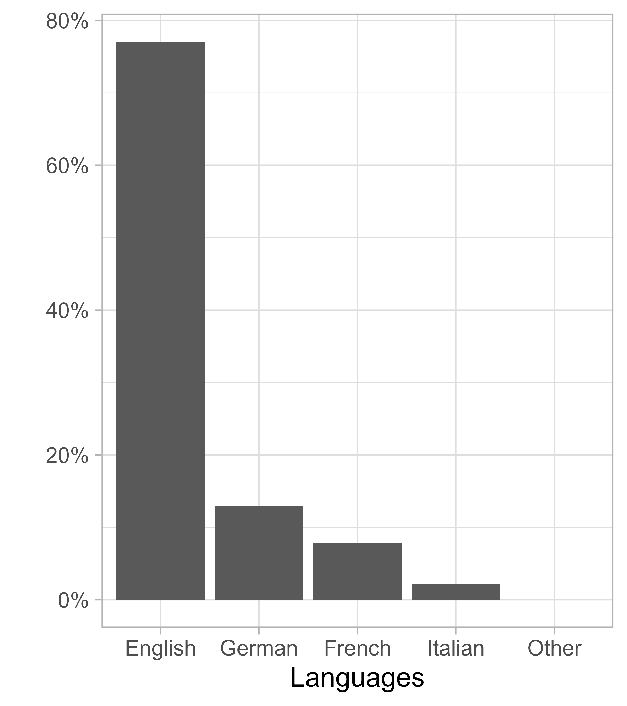

```{r}
#| echo: false
#| message: false
#| warning: false
#| include: false


# move to the root directory of the project with "here::here()"
source(here::here("scripts", "paths_and_packages.R"))

```

## Context 

:::{.highlight-last}
- **Special issue**: methods in the history of economic thought (HET)

- **Goal**: contribute a methodological essay showing how quantitative tools can enrich history of economic thought

- **Neither a proof of concept paper, nor a review of methods**
:::

## Our contribution

:::{.highlight-last}
:::{.fragment .nonincremental}
- The meanings of rationality in 20<sup>th</sup>-century economics:  
  - A long-standing concern for historians  
  - Using computational methods to capture the broader picture  
:::

:::{.fragment .nonincremental}
- A concrete methodological reflection based on our workflow:  
  - Challenges, successes, limits, and possible improvements  
:::
:::

:::{.notes}
- Pour des raisons de temps notamment, on ne va pas parler vraiment de rationalité aujourd'hui, même si quelques résultats à la fin.
:::

## From sources to corpus 

:::{.highlight-last}
- Our main source: JSTOR fulltext database (around 300 000 documents, 31 millions sentences).


::: {.callout-warning .fragment .nonincremental}
### It is sometimes more challenging to build the data than to analyze it:

- Access to the source (JSTOR Data for Research). 
- Filtering documents (book reviews). 
- Cleaning texts (headers, acknowledgments, etc.).
- Matching datasets (JSTOR + WoS).
- Handling large datasets. 
:::
:::

## 

::: {#fig-distribution layout-ncol=2}
{width=90%}

:::{.fragment}
{width=90%}
:::
Distribution of documents in the JSTOR fulltext database
::: 

:::{.notes}
- A noter: trajectoire pas si exponentielle (par rapport à la bibliométrie par exemple). On a tout de même un corpus assez conséquent pour les premières années.
- Pas si mal non plus pour les langues, au vu de l'internationalisation post-1970. Mais comment traiter le multi-langue?
:::

##

::: {#fig-exploration layout-ncol=2}


:::{.fragment}

:::
Exploration of the corpus with simple text analysis tools

::: 


## Which computational methods?

:::{.fragment}
::: {#fig-computation_methods layout-ncol=2}

{width=100%}

{width=100%}

Illustrations of common unsupervised methods in HET for large-scale analysis

:::
:::

## Introducing LLMs to HET 


:::: {.columns}
::: {.column width="60%"}

{#fig-vector_space width=80%}
:::

::: {.column width="40%"}
::: {.callout-note appearance="simple"}
LLMs: Each unique word are represented as vectors. 
::: 

::: {.callout-warning appearance="simple"}
The distance between vectors reflects semantic similarity.
::: 
::: 
::::

## Sentence embeddings 

::: {.callout-note appearance="simple"}
We use sentence-BERT, a fast LLM model that reprensents **sentences** as vectors and is optimized for semantic similarity tasks.
::: 

:::: {.columns}
::: {.column width="31%" .fragment}
::: {.callout-note}
### Our empirical strategy:
1. Compute a "representative vectors" for the concept of rationality.
2. Retrieve the most similar sentences in the corpus from this vector.
3. Group those sentences into clusters.
::: 
:::

::: {.column .fragment width="69%"}

```{r}
#| echo: false
#| message: false 
#| warning: false
#| label: tbl-top_sentences
#| tbl-cap: "Closest to 'Economic agents are supposed to be rational.'"

# load data OUTPUT_FILE = top_5_sentences_to_fake_sentence.feather

data <- arrow::read_feather(here::here(data_path, "top_5_sentences_to_fake_sentence.feather"))

# ;2 "Basically, for Professor Hicks, as for Jevons and Marshall, economic decisions are made by an abstract calculating machine";3 "I find myself continuing to believe ... that, whatever the origin of the want, when it rises to consciousness, it is subject to a process which we call rational, when the human agent decides 
sentence_clean <- "Basically, for Professor Hicks, as for Jevons and Marshall, economic decisions are made by an abstract calculating machine."

data |> 
  filter(rank < 4, year %in% c(1950, 1975, 2000)) |>
  mutate(sentence = ifelse(str_detect(sentence, "^;"), sentence_clean, sentence)) |>
  # kable the table
  select(year, sentence, similarity) |>
  mutate(similarity = round(similarity, 3)) |>
  knitr::kable() |> 
  kableExtra::kable_styling(full_width = F, font_size = 18) 

```
::: 
::::

:::{.notes}
- Not the word "rational" or "rationality" in the first sentence
:::

## 

{width=100%}

## Navigating our own results with an app 

[https://0199205a-7b17-ab11-595d-8f12aae160dd.share.connect.posit.cloud/](https://0199205a-7b17-ab11-595d-8f12aae160dd.share.connect.posit.cloud/)

## Conclusion

:::{.highlight-last}
- LLMs offers a tool to quantify conceptual relationship betweens texts. 

:::{.fragment} 
:::{.callout-caution}

### But important challenges: 
- Existing models are trained for understanding general language, not economic discourses.
- Model are present-centric.
- Computational ressources.
- Data access (Elsevier, Taylor and Francis, Books, *etc*.).

::: 
:::
:::
